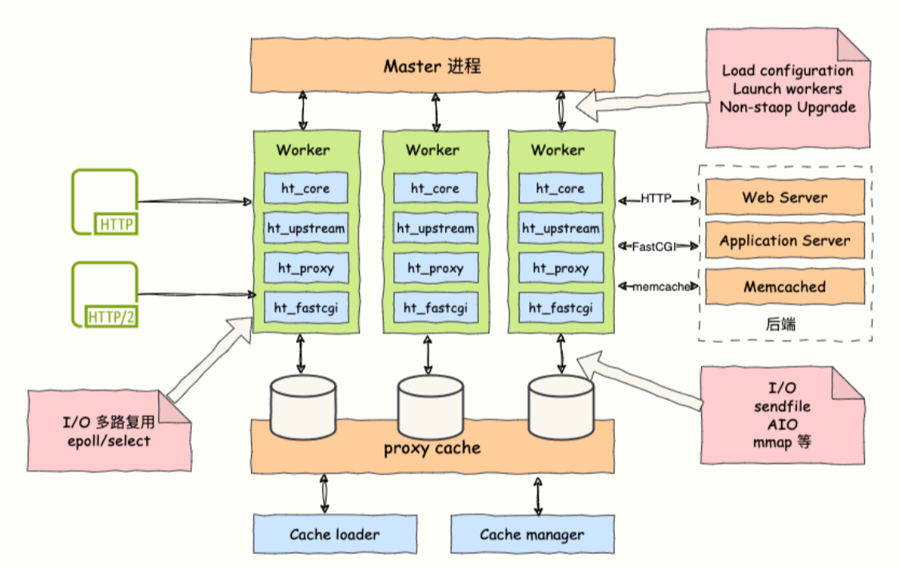
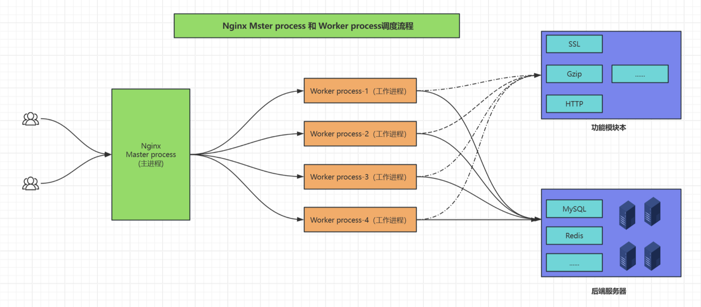
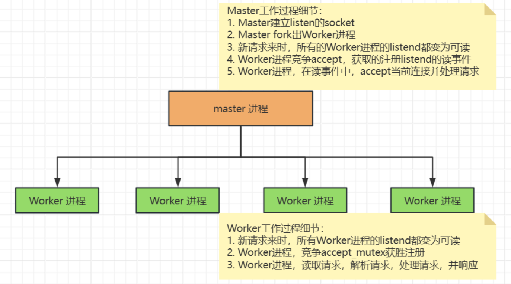
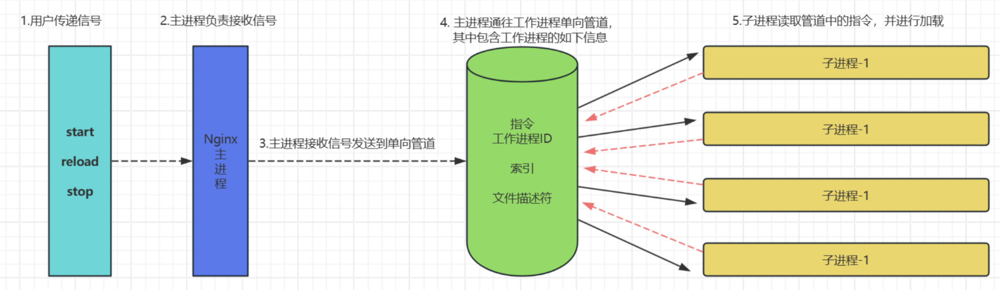
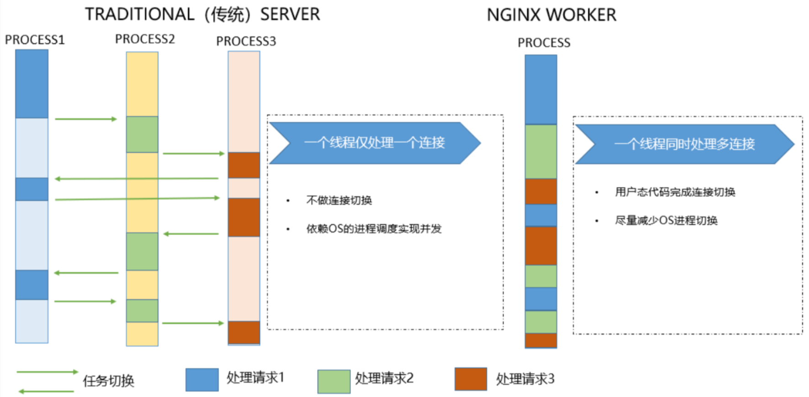
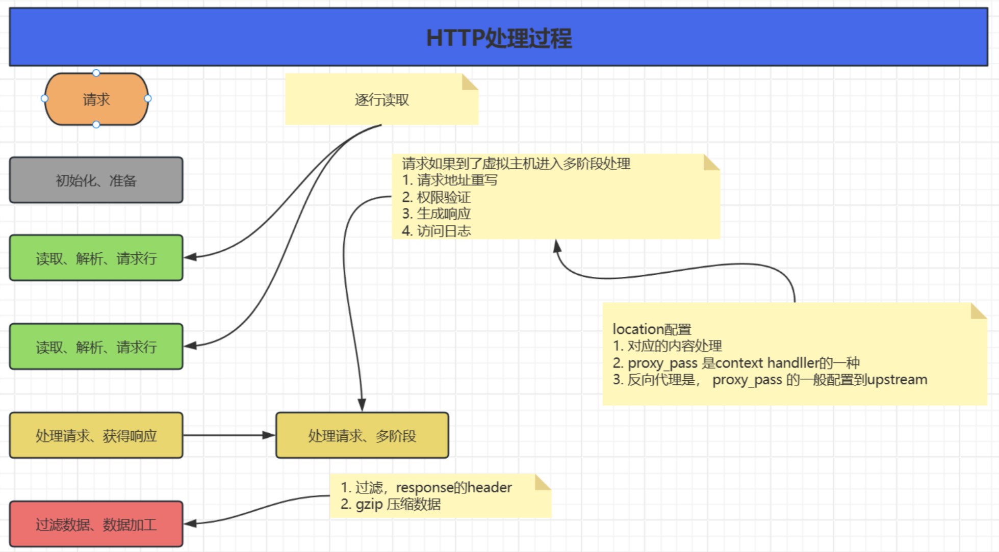
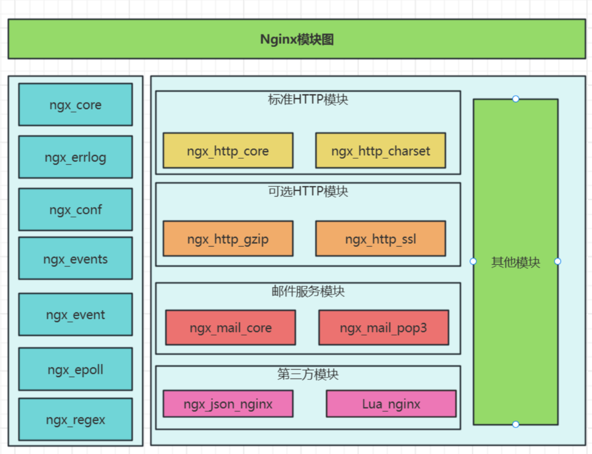

# Nginx概念与架构

## 1.Nginx介绍

1. Nginx是一个高性能的Web和反向代理服务器
   - 作为Web服务器：Nginx使用更少的资源，支持更多的并发连接，体现更高的效率，能够支持搞到50000个并发连接数的响应。
   - 作为负载均衡服务器：Nginx既可以在内部直接支持PHP，可以支持作为HTTP代理服务器对外进行服务，系统资源开销比较小。
2. Nginx功能介绍
   - 静态的Web资源服务器html，图片，解释、，css等静态资源
   - HTTP和HTTPS协议的反向代理
   - 结合fastCG/WSGI、SCGI等协议反向代理动态资源请求
   - TCP和UDP协议的请求转发（反向代理）
3. 特性
   - 模块化设计，较好的扩展性
   - 高可靠性
   - 支持热部署，不停机更新配置文件，版本升级，更好日志文件
   - 低内存型号，10000个Keep-alive连接模式下的非活动连接，仅需2.5M内存

## 2.Nginx整体架构

### 2.1. Nginx进程结构

1. Nginx Master Process
   - Master进程主要用来管理Worker进程，包含：接收来自外界的信号，向各Worker进程发送信号，监控Worker进程的运行状态，当Worker进程退出后或者异常情况下会自动重启新的Worker进程
     - 对外接口：接收外部的操作（信号）
     - 对内转发：根据外部的操作的不同，通过信号管理 Worker
     - 监控：监控 worker 进程的运行状态，worker 进程异常终止后，自动重启 worker 进程
     - 读取Nginx 配置文件并验证其有效性和正确性，建立、绑定和关闭socket连接，按照配置生成、管理和结束工作进程，接受外界指令，比如重启、升级及退出服务器等指令
2. Nginx Woker Process
   - 基本的网络请求则是放在Worker进程中来处理的，多个Worker进程之间是对等，他们是同等竞争来自客户端的请求，各进程之间是相互独立的，Worker进程的个数是可以设置的，一般与服务器的CPU合数一致。
     - 所有Worker 进程都是平等的，实际处理：网络请求，由 Worker 进程处理
     - Worker进程数量：一般设置为核心数，充分利用CPU资源，同时避免进程数量过多，导致进程竞争CPU资源，增加上下文切换的损耗
     - 接收处理客户的请求，将请求依次送入各个功能模块进行处理I/O调用，获取响应数据与后端服务器通信，接收后端服务器的处理结果缓存数据，访问缓存索引，查询和调用缓存数据发送请求结果，响应客户的请求
     - 接收程序指令，比如重启、升级和退出等
3. Nginx的高性能
   - 采用多进程的模型，对与每个Worker进程来说，独立的进场不需要枷锁，省掉锁带来的开销。
   - Nginx支持epoll处理连接的方法（I/O复用方法）

### 2.2. Nginx进程间通信

1. 工作进程是由主进程生成的，主进程使用fork()函数，在Nginx服务器启动过程中主进程根据配置文件决定启动工作进程的数量，然后建立一张全局的工作表用于存放当前未退出的所有的工作进程，主进程生成工作进程后会将新生成的工作进程加入到工作进程表中，并建立一个单向的管道并将其传递给工作进程，该管道与普通的管道不同，它是由主进程指向工作进程的单向通道，包含了主进程向工作进程发出的指令、工作进程ID、工作进程在工作进程表中的索引和必要的文件描述符等信息。
2. 主进程与外界通过信号机制进行通信，当接收到需要处理的信号时，它通过管道向相关的工作进程发送正确的指令，每个工作进程都有能力捕获管道中的可读事件，当管道中有可读事件的时候，工作进程就会从管道中读取并解析指令，然后采取相应的执行动作，这样就完成了主进程与工作进程的交互。

1. worker进程之间的通信原理基本上和主进程与worker进程之间的通信是一样的，只要worker进程之间能够取得彼此的信息，建立管道即可通信，但是由于worker进程之间是完全隔离的，因此一个进程想要知道另外一个进程的状态信息,就只能通过主进程来实现。
2. 为了实现worker进程之间的交互，master进程在生成worker进程之后，在worker进程表中进行遍历，将该新进程的PID以及针对该进程建立的管道句柄传递给worker进程中的其他进程，为worker进程之间的通信做准备，当worker进程1向worker进程2发送指令的时候，首先在master进程给它的其他worker进程工作信息中找到2的进程PID，然后将正确的指令写入指向进程2的管道，worker进程2捕获到管道中的事件后，解析指令并进行相关操作，这样就完成了worker进程之间的通信。
3. 另worker进程可以通过共享内存来通讯的，比如upstream中的zone，或者limit_req、limit_conn中的zone等。操作系统提供了共享内存机制

### 2.3. Nginx启动和HTTP建立连接

1. Nginx 启动时，Master 进程，加载配置文件
2. Master 进程，初始化监听的 socket
3. Master 进程，fork 出多个 Worker 进程
4. Worker 进程，竞争新的连接，获胜方通过三次握手，建立 Socket 连接，并处理请求

- HTTP处理过程

## 3.Nginx模块介绍

1. 核心模块：是 Nginx 服务器正常运行必不可少的模块，提供错误日志记录 、配置文件解析 、事件驱动机制 、进程管理等核心功能
2. 标准HTTP模块：提供 HTTP 协议解析相关的功能，比如： 端口配置 、 网页编码设置 、 HTTP响应头设置 等等
3. 可选HTTP模块：主要用于扩展标准的 HTTP 功能，让 Nginx 能处理一些特殊的服务，比如： Flash 多媒体传输 、解析 GeoIP 请求、 网络传输压缩 、 安全协议 SSL 支持等
4. 邮件服务模块：主要用于支持 Nginx 的 邮件服务 ，包括对 POP3 协议、 IMAP 协议和 SMTP协议的支持
5. Stream服务模块: 实现反向代理功能,包括TCP协议代理
6. 第三方模块：是为了扩展 Nginx 服务器应用，完成开发者自定义功能，比如： Json 支持、 Lua 支持等

### 3.1.模块分类

1. 核心模块：core module
2. 标准模块：
   -  HTTP 模块： ngx_http_*
   -  HTTP Core modules  #默认功能
   -  HTTP Optional modules #需编译时指定
   -  Mail 模块: ngx_mail_*
   -  Stream 模块 ngx_stream_*
3. 第三方模块

