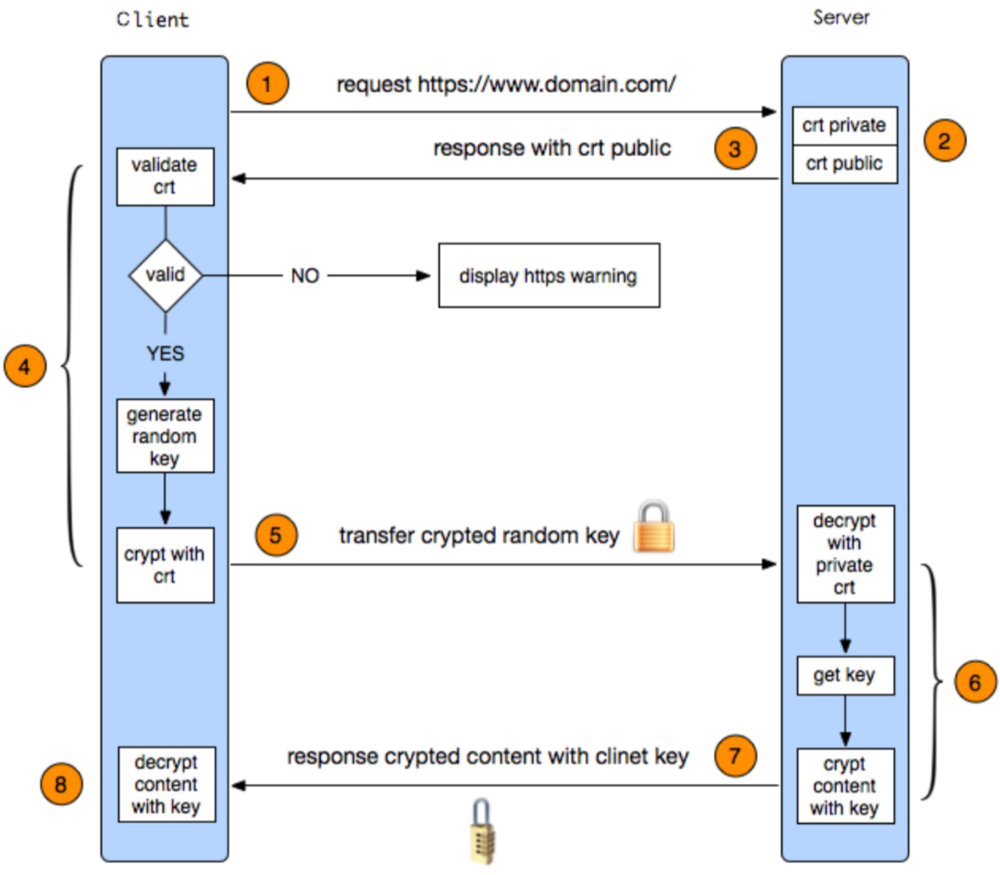
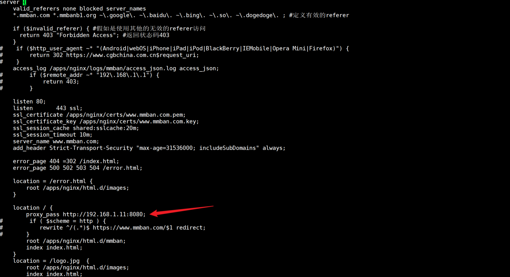

# Nginx配置文件

## 1.Nginx命令和信号

### 1.1.Nginx命令

~~~shell
nginx 命令支持向其发送信号,实现不同功能  
1. nginx 格式：
  a. nginx [-?hvVtTq] [-s signal] [-c filename] [-p prefix] [-g directives]
2. 选项说明：
  a. 帮助: -? -h
  b. 使用指定的配置文件: -c
  c. 指定配置指令:-g
  d. 指定运行目录:-p
  e. 测试配置文件是否有语法错误:-t -T
  f. 打印nginx的版本信息、编译信息等:-v -V
  g. 发送信号: -s 示例: nginx -s reload
3. 信号说明：
  a. 立刻停止服务：stop,相当于信号SIGTERM,SIGINT
  b. 优雅的停止服务:quit,相当于信号SIGQUIT
  c. 平滑重启，重新加载配置文件: reload,相当于信号SIGHUP
  d. 重新开始记录日志文件:reopen,相当于信号SIGUSR1,在切割日志时用途较大
  e. 平滑升级可执行程序:发送信号SIGUSR2,在升级版本时使用
  f. 优雅的停止工作进程:发送信号SIGWINCH,在升级版本时使用
~~~

### 1.2. QUIT 实现worker进程优雅关闭

1. 在 Nginx 中，实现 worker 进程的优雅关闭可以通过向主进程发送 QUIT 信号来完成。这个操作会使主进程通知所有 worker 进程完成当前处理的请求后再退出，从而避免中断正在进行的请求。

~~~shell
## 1. 查找 Nginx 主进程的 PID
[root@T-YYY10K-45 /apps/nginx]# cat /apps/nginx/logs/nginx.pid 
9834

## 2. 发送 QUIT 信号到主进程，一旦你获取到 Nginx 主进程的 PID，可以使用 kill 命令发送 QUIT 信号
[root@T-YYY10K-45 /apps/nginx]# kill -QUIT 9976
这个命令会触发 Nginx 主进程执行以下操作：
  1.停止接收新的连接。
  2.通知所有 worker 进程完成当前正在处理的请求后退出。
  3.当所有 worker 进程退出后，主进程自身也会退出。

## 3. 确认 Nginx 已经优雅地关闭
[root@T-YYY10K-45 /apps/nginx]# ps  -ef | grep   nginx
~~~

### 1.3. reload流程

1. 利用 reload 可以实现平滑修改配置并生效，不重启或者不停机，加载新的配置文件
2. 向master进程发送HUP信号(reload命令)
3. master进程校验配置语法是否正确，打开新的监听端口，用新配置启动新的worker子进程向老worker子进程发送QUIT信号，老的worker对已建立连接继续处理，处理完才会优雅退出.未关闭的worker旧进程不会处理新来的请求
4. 老worker进程关闭监听句柄，处理完当前连接后结束进程

## 2.配置目录

1. conf：保存nginx所有的配置文件，其中nginx.conf是nginx服务器的最核心最主要的配置文件，其他的.conf则是用来配置nginx相关的功能的，例如fastcgi功能使用的是fastcgi.conf和fastcgi_params两个文件，配置文件一般都有一个样板配置文件，是以.default为后缀，使用时可将其复制并将default后缀去掉即可。
2. html：目录中保存了nginx服务器的web文件，但是可以更改为其他目录保存web文件,另外还有一个50x的web文件是默认的错误页面提示页面。
3. logs：用来保存nginx服务器的访问日志错误日志等日志，logs目录可以放在其他路径，比如/var/logs/nginx里面。
4. sbin：保存nginx二进制启动脚本，可以接受不同的参数以实现不同的功能。

## 3.Nginx核心配置文件详解

1. nginx 官方帮助文档
   - http://nginx.org/en/docs/
2. tengine 帮助文档
   - http://tengine.taobao.org/nginx_docs/cn/docs/
3. Nginx的配置文件的组成部分
   - 主配置文件：nginx.conf
   - 子配置文件: include conf.d/*.conf
   - fastcgi， uwsgi，scgi 等协议相关的配置文件
   - mime.types：支持的mime类型，MIME(Multipurpose Internet Mail Extensions)多用途互联网邮件扩展类型，MIME消息能包含文本、图像、音频、视频以及其他应用程序专用的数据，是设定某种扩展名的文件用一种应用程序来打开的方式类型，当该扩展名文件被访问的时候，浏览器会自动使用指定应用程序来打开。多用于指定一些客户端自定义的文件名。
   - MIME参考文档：https://developer.mozilla.org/zh-CN/docs/Web/HTTP/Basics_of_HTTP/MIME_Types
4. nginx 配置文件格式说明
   - 配置文件由指令与指令块构成
   - 每条指令以;分号结尾，指令与值之间以空格符号分隔
   - 指令块以{ }大括号将多条指令组织在一起,且可以嵌套指令块
   - include语句允许组合多个配置文件以提升可维护性
   - 使用$符号使用变量，部分指令的参数支持正则表达式

~~~shell
Nginx 主配置文件的配置指令方式：
directive value [value2 ...];
注意
(1) 指令必须以分号结尾
(2) 支持使用配置变量
 内建变量：由Nginx模块引入，可直接引用
 自定义变量：由用户使用set命令定义,格式: set variable_name value;
 引用变量：$variable_name

 
主配置文件结构：四部分
 
main block：主配置段，即全局配置段，对http,mail都有效
 
#事件驱动相关的配置
event {
 ...
}   

#http/https 协议相关配置段
http {
 ...
}     

#默认配置文件不包括下面两个块
#mail 协议相关配置段
mail {
 ...
}    

#stream 服务器相关配置段
stream {
 ...
}
~~~

### 3.1.默认nginx.conf配置文件格式说明

~~~shell
## 全局配置端，对全局生效，主要设置nginx的启动用户/组，启动的工作进程数量，工作模式，Nginx的PID
路径，日志路径等。
user nginx nginx;
worker_processes  auto;   #启动工作进程数数量

 #events设置块，主要影响nginx服务器与用户的网络连接，比如是否允许同时接受多个网络连
接，使用哪种事件驱动模型处理请求，每个工作进程可以同时支持的最大连接数，是否开启对多工作进程下的
网络连接进行序列化等。
events {
     #设置单个nginx工作进程可以接受的最大并发，
     #作为web服务器的时候最大并发数为worker_connections * worker_processes
     #作为反向代理的时候为(worker_connections * worker_processes)/2
     worker_connections  1024;
}

 #http块是Nginx服务器配置中的重要部分，缓存、代理和日志格式定义等绝大多数功能和第三方模块都可以在这设置，http块可以包含多个server块，而一个server块中又可以包含多个location块，server块可以配置文件引入、MIME-Type定义、日志自定义、是否启用sendfile、连接超时时间和单个链接的请求上限等。
 http {
    include       mime.types;
    default_type application/octet-stream;

    #作为web服务器的时候打开sendfile加快静态文件传输，指定是否使用sendfile系统调用来传输文件,  
    #sendfile系统调用在两个文件描述符之间直接传递数据(完全在内核中操作)，从而避免了数据在内核缓 
    #冲区和用户缓冲区之间的拷贝，操作效率很高，被称之为零拷贝，硬盘 >>  kernel buffer (快速拷贝到kernelsocket buffer) >>协议栈
    sendfile       on;
    
    keepalive_timeout  65;  #长连接超时时间，单位是秒

     #设置一个虚拟机主机，可以包含自己的全局快，同时也可以包含多个location模块。比如本虚拟机监听的端口、本虚拟机的名称和IP配置，多个server 可以使用一个端口，比如都使用80端口提供web服务。
     server {
         listen       80;  #配置server监听的端口
         #本server的名称，当访问此名称的时候nginx会调用当前serevr内部的配置进程匹配。
         server_name localhost;
         
          #location其实是server的一个指令，为nginx服务器提供比较多而且灵活的指
令都是在location中体现的，主要是基于nginx接受到的请求字符串，对用户请求的UIL进行匹配，并对特
定的指令进行处理，包括地址重定向、数据缓存和应答控制等功能都是在这部分实现，另外很多第三方模块的配置也是在location模块中配置。
         location / {
                root   html; #相当于默认页面的目录名称，默认是安装目录的相对路径，可以使用绝对路径配置。
                index index.html index.htm; #默认的页面文件名称

        }

        error_page   500 502 503 504 /50x.html; #错误页面的文件名称
        location = /50x.html { #location处理对应的不同错误码的页面定义到/50x.html，这个跟对应其server中定义的目录下.
          root   html;  #定义默认页面所在的目录
          }
     }

     #导入其他路径的配置文件
     include /apps/nginx/conf.d/*.conf
 }
~~~

### 3.2全局配置

1. Main 全局配置段常见的配置指令分类
2. 正常运行必备的配置
3. 优化性能相关的配置
4. 用于调试及定位问题相关的配置
5. 事件驱动相关的配置

~~~shell
#启动Nginx工作进程的用户和组
user nginx nginx;

#启动Nginx工作进程的数量,一般设为和CPU核心数相同
worker_processes [number | auto];

#将Nginx工作进程绑定到指定的CPU核心默认Nginx是不进行进程绑定的，绑定并不是意味着当前nginx进程独占以一核心CPU，但是可以保证此进程不会运行在其他核心上，这就极大减少了nginx的工作进程在不同的cpu核心上的来回跳转，减少了CPU对进程的资源分配与回收以及内存管理等，可以有效的提升nginx服务器的性能。
worker_cpu_affinity 00000001 00000010 00000100 00001000 | auto ;

#示例:
#worker_cpu_affinity 0001 0010 0100 1000;第0号---第3号CPU
#worker_cpu_affinity 0101 1010;

#worker_processes  4;
worker_cpu_affinity 00000010 00001000 00100000 10000000;

#错误日志记录配置，语法：error_log file [debug | info | notice | warn | error | crit | alert | emerg]
error_log /apps/nginx/logs/error.log error;

#pid文件保存路径
pid       /apps/nginx/logs/nginx.pid;

#工作进程优先级，-20~20(19)，影响 Nginx 在系统中的资源分配。
1. 提高性能和响应速度
  设置较高的优先级（负值）可以让 Nginx 工作进程更频繁地获得 CPU 时间片，特别是在系统负载较高的情况下，可以提高处理请求的速度和整体性能。
worker_priority 0;

#所有worker进程能打开的文件数量上限,包括:Nginx的所有连接（例
如与代理服务器的连接等），而不仅仅是与客户端的连接,另一个考虑因素是实际的并发连接数不能超过系统级
别的最大打开文件数的限制.最好与ulimit -n 或者limits.conf的值保持一致
worker_rlimit_nofile 65536;
~~~

### 3.3.http配置

~~~shell

http {
 ...
 ...  #各server的公共配置
 server {    #每个server用于定义一个虚拟主机,第一个server为默认虚拟服务器
 ...
 }
 server {     
 ...
 server_name   #虚拟主机名
 root     #主目录
 alias     #路径别名
 location [OPERATOR] URL {     #指定URL的特性
 ...
 if CONDITION {
 ...
   }
  }
 }
}
~~~

#### 3.3.1.配置说明

~~~shell
http {
    #导入支持的文件类型,是相对于/apps/nginx/conf的目录
    include       mime.types;

    #除mime.types中文件类型外,设置其它文件默认类型，访问其它类型时会提示下载不匹配的类型文件
    default_type application/octet-stream;

    #日志配置部分
    #log_format main '$remote_addr - $remote_user [$time_local] "$request" '
    #                 '$status $body_bytes_sent "$http_referer" '
    #                 '"$http_user_agent" "$http_x_forwarded_for"';
    #access_log logs/access.log main;
    
    #自定义优化参数
    sendfile       on;

    #设置会话保持时间, 第二个值为响应首部:keep-Alived:timeout=65,可以和第一个值不同
    keepalive_timeout  65 65;

    #开启文件压缩
    gzip on;

    server {
        listen       80; #设置监听地址和端口
        
        #设置server name，可以以空格隔开写多个并支持正则表达式，如:*.magedu.com www.magedu.* ~^www\d+\.magedu\.com$ default_server
        server_name localhost;

        location / {
            root   html;
            index index.html index.htm;
        }
    }
}
~~~

### 3.4.MIME

~~~shell
#在响应报文中将指定的文件扩展名映射至MIME对应的类型
include           /etc/nginx/mime.types;

default_type     application/octet-stream;#除mime.types中的类型外，指定其它文件的默认MIME类型，浏览器一般会提示下载

types {
   text/html html;
   image/gif gif;
   image/jpeg jpg;
}

#MIME参考文档：
https://developer.mozilla.org/zh-CN/docs/Web/HTTP/Basics_of_HTTP/MIME_Types
~~~

### 3.5.配置文件参数

#### 3.5.1.指定响应报文Server首部

~~~shell
#是否在响应报文中的Content-Type显示指定的字符集，默认off不显示
charset charset | off;

#示例
charset utf-8;

#是否在响应报文的Server首部显示nginx版本
server_tokens on | off | build | string;
~~~

#### 3.5.2自定义响应报文的nginx版本信息

~~~shell
# 如果想自定义响应报文的nginx版本信息，需要修改源码文件，重新编译
# 如果server_tokens on，修改 src/core/nginx.h 修改第13-14行，如下示例
define NGINX_VERSION     "1.68.9"
define NGINX_VER         "wanginx/" NGINX_VERSION

# 如果server_tokens off，修改 src/http/ngx_http_header_filter_module.c 第49行，如下示例：
static char ngx_http_server_string[] = "Server: nginx" CRLF;

## 1.关闭nginx进程
[root@T-YYY10K-45 /root]# nginx  -s stop

## 2. 查看nginx模块
[root@T-YYY10K-45 /root]# nginx  -V
nginx version: nginx/1.26.1
built by gcc 8.5.0 20210514 (Red Hat 8.5.0-10) (GCC) 
built with OpenSSL 1.1.1k  FIPS 25 Mar 2021
TLS SNI support enabled
configure arguments: --prefix=/apps/nginx --user=nginx --group=nginx --with-http_ssl_module --with-http_v2_module --with-http_realip_module --with-http_stub_status_module --with-http_gzip_static_module --with-pcre --with-stream --with-stream_ssl_module --with-stream_realip_module

## 3.重新编译
[root@T-YYY10K-45 /usr/local/src/nginx-1.26.1]# ./configure  --prefix=/apps/nginx --user=nginx --group=nginx\
> --with-http_ssl_module --with-http_v2_module --with-http_realip_module \
> --with-http_stub_status_module --with-http_gzip_static_module --with-pcre --with-stream \
> --with-stream_ssl_module --with-stream_realip_module

## 4. 安装，启动
[root@T-YYY10K-45 /usr/local/src/nginx-1.26.1]# make  && make install
[root@T-YYY10K-45 /usr/local/src/nginx-1.26.1]# nginx

## 5.验证
[root@T-YYY10K-45 /usr/local/src/nginx-1.26.1]# curl  -I  www.mmban.com
HTTP/1.1 200 OK
Server: mmban-nginx
Date: Thu, 06 Jun 2024 12:32:02 GMT
Content-Type: text/html; charset=utf-8
Content-Length: 35
Last-Modified: Thu, 06 Jun 2024 12:10:30 GMT
Connection: keep-alive
ETag: "6661a736-23"
Accept-Ranges: bytes
~~~

### 4.nginx子配置文件

~~~shell
## 在配置文件的最后面添加此行,注意不要放在最前面,会导致前面的命令无法生效

http {

.........
## 最后http模块最后一行
include /apps/nginx/conf.d/*.conf;
}
~~~

### 5.location详细使用

1. 在一个server中location配置段可存在多个，用于实现从uri到文件系统的路径映射；ngnix会根据用户请求的URI来检查定义的所有location，按一定的优先级找出一个最佳匹配，而后应用其配置
2. 在没有使用正则表达式的时候，nginx会先在server中的多个location选取匹配度最高的一个uri，uri是用户请求的字符串，即域名后面的web文件路径，然后使用该location模块中的正则url和字符串，如果匹配成功就结束搜索，并使用此location处理此请求。
3. http://nginx.org/en/docs/http/ngx_http_core_module.html#location
4. location 正则表达式
   - =:  用于标准uri前，需要请求字串与uri精确匹配，大小敏感,如果匹配成功就停止向下匹配并立即处理请求
   - ^~:  用于标准uri前，表示包含正则表达式,并且匹配以指定的正则表达式开头,对uri的最左边部分做匹配检查，不区分字符大小写
   - ~:  用于标准uri前，表示包含正则表达式,并且区分大小写
   - ~*:  用于标准uri前，表示包含正则表达式,并且不区分大写不带符号 #匹配起始于此uri的所有的uri
   - \ :  用于标准uri前，表示包含正则表达式并且转义字符。可以将 . * ?等转义为普通符号
   - ?：匹配任意单个字符（除了换行符）或没有字符。表示前面的字符出现零次或一次。
   - 匹配优先级从高到低：
     - =,  ^~,  ~/~*,  不带符号

~~~shell
Syntax:	location [ = | ~ | ~* | ^~ ] uri { ... }

location @name { ... }

Default:	—

Context:	server, location

####################################
官方：location = / {
    [ configuration A ]
}

location / {
    [ configuration B ]
}

location /documents/ {
    [ configuration C ]
}

location ^~ /images/ {
    [ configuration D ]
}

location ~* \.(gif|jpg|jpeg)$ {
    [ configuration E ]
}
~~~

#### 5.1.精确匹配

1. 在server部分使用location配置一个web界面，例如：当访问nginx 服务器的/logo.jpg的时候要显示指定html文件的内容
2. 精确匹配一般用于匹配组织的logo等相对固定的URL,匹配优先级最高

~~~shell
## 配置文件
[root@T-YYYPT-test45 /apps/nginx/conf.d]# cat mmban.conf
server {
    listen 80;
    server_name www.mmban.com;
    location / {
        root /apps/nginx/html.d/mmban;
        index index.html;
    }
    location = /logo.jpg  {
        root /apps/nginx/html.d/images;
        index index.html;
   }
}

## html文件
[root@T-YYYPT-test45 /apps/nginx/html.d]# tree  .
.
├── images
│   ├── index.html
│   └── logo.jpg
└── mmban
    └── index.html

## 重启Nginx并测试访问  http://www.mmban.com/logo.jpg
~~~

#### 5.2.区分大小写

1. ~ 实现区分大小写的模糊匹配
2. 以下范例中, 如果访问uri中包含大写字母的JPG，则以下location匹配Ax.jpg条件不成功，因为 ~ 区分大小写，当用户的请求被执行匹配时发现location中定义的是小写的jpg，本次访问的uri匹配失败，后续要么继续往下匹配其他的location（如果有），要么报错给客户端。

~~~shel
## 配置文件
[root@T-YYYPT-test45 /apps/nginx/conf.d]# cat mmban.conf
server {
    listen 80;
    server_name www.mmban.com;
    location / {
        root /apps/nginx/html.d/mmban;
        index index.html;
    }
    location = /logo.jpg  {
        root /apps/nginx/html.d/images;
        index index.html;
   }

   location ~ /A.?\.jpg {   #匹配字母A开头的jpg图片，后面?表示A后面零次或一个字符
       root /apps/nginx/html.d/images;
       index index.html;
  }
}
~~~

#### 5.3.不区分大小写

1. ~* 用来对用户请求的uri做模糊匹配，uri中无论都是大写、都是小写或者大小写混合，此模式也都会匹配。
2. 通常使用此模式匹配用户request中的静态资源并继续做下一步操作
3. 此方式中,对于Linux文件系统上的文件仍然是区分大小写的,如果磁盘文件不存在,仍会提示404

~~~shell
## 配置文件
[root@T-YYYPT-test45 /apps/nginx/conf.d]# cat  mmban.conf
server {
    listen 80;
    server_name www.mmban.com;
    location / {
        root /apps/nginx/html.d/mmban;
        index index.html;
    }
    location = /logo.jpg  {
        root /apps/nginx/html.d/images;
        index index.html;
   }

   location ~ /A.?\.jpg {   #匹配字母A开头的jpg图片，后面?表示A后面零次或一个字符
       root /apps/nginx/html.d/images;
       index index.html;
  }

   location ~* /A.?\.jpg {
       root /apps/nginx/html.d/images;
       index index.html;
  }

}

## html文件
[root@T-YYYPT-test45 /apps/nginx/html.d/images]# tree  .
.
├── ab.jpg
├── aB.jpg
├── Ab.jpg
├── AB.jpg
├── index.html
└── logo.jpg

## 重启nginx，测试访问
对于不区分大小写的location，则可以访问任意大小写结尾的图片文件,如区分大小写则只能访问Aa.jpg此
类文件，不区分大小写则可以访问除了aa.jpg以外,还有其它的资源比如Aa.JPG、aA.jPG这样的混合名称文
件，但是还同时也要求nginx服务器的资源目录有相应的文件，比如:必须有Aa.JPG,aA.jPG这样文件存在。
~~~

#### 5.4.URI开始与文件名后缀匹配

1. 在 Nginx 中，可以使用 location 指令来匹配 URI 开头部分和文件名后缀的组合。如果希望同时匹配 URI 的开头和特定的文件后缀，可以结合前缀匹配和正则表达式来实现。

~~~shell
## 配置文件
[root@T-YYYPT-test45 /apps/nginx/conf.d]# cat mmban.conf
server {
    listen 80;
    server_name www.mmban.com;
    location / {
        root /apps/nginx/html.d/mmban;
        index index.html;
    }
    location = /logo.jpg  {
        root /apps/nginx/html.d/images;
        index index.html;
   }

   location ~ /A.?\.jpg {   #匹配字母A开头的jpg图片，后面?表示A后面零次或一个字符
       root /apps/nginx/html.d/images;
       index index.html;
  }

   location ~* /A.?\.jpg {
       root /apps/nginx/html.d/images;
       index index.html;
  }
   location ~ ^/jpg/.*\.jpg$ {
       root /apps/nginx/html.d/images;
       index index.html;

  }

}

## html配置文件
root@T-YYYPT-test45 /apps/nginx/html.d/images~ # tree
.
├── Abcd.jpg
├── ab.jpg
├── aB.jpg
├── Ab.jpg
├── AB.jpg
├── index.html
├── jpg
│   ├── Abcd.jpg
│   ├── ab.jpg
│   ├── aB.jpg
│   ├── Ab.jpg
│   ├── AB.jpg
│   └── logo.jpg
└── logo.jpg
~~~

#### 5.5.优先级

1. 匹配优先级：=, ^~, ～/～*，/
2. location优先级：(location =) > (location ^~ 路径) > (location ~,~* 正则顺序) > (location 完整路径) > (location 部分起始路径) > (/)

~~~shell
## 配置文件，优先级重上之下依次匹配
server {
    listen 80;
    server_name www.mmban.com;

    # 精确匹配
    location = /exact {
        # 配置内容
    }

    # 高优先级前缀匹配
    location ^~ /static/ {
        # 配置内容
    }

    # 正则匹配，大小写敏感
    location ~ \.php$ {
        # 配置内容
    }

    # 正则匹配，大小写不敏感
    location ~* \.(gif|jpg|jpeg)$ {
        # 配置内容
    }

    # 标准前缀匹配
    location /images/ {
        # 配置内容
    }

    location / {
        # 配置内容
    }
}
~~~

### 6.root与alias

1. root：指定web的家目录，在定义location的时候，文件的绝对路径等于 root+location
2. alias：定义路径别名，会把访问的路径重新定义到其指定的路径,文档映射的另一种机制;仅能用于location上下文,此指令使用较少

~~~shell
server {
    listen 80;
    server_name www.cy.com;

    location / {
        root /apps/nginx/html.d/cy;
        index index.html;
    }

     #注意about后不要加/ , 使用alias的时候uri后面如果加了斜杠,则下面的路径配置必须加斜杠，否则403
    location /about1 {
         
         #当访问about的时候，会显示alias定义的/opt/html/about里面的内容。
        alias /mnt/html/about1;
   }

}
~~~

### 7.Nginx四层访问控制

1. 访问控制基于模块ngx_http_access_module实现，可以通过匹配客户端源IP地址进行限制
2. 如果能在防火墙设备控制,最好就不要在nginx上配置,可以更好的节约资源
3. 官方帮助手册：http://nginx.org/en/docs/http/ngx_http_access_module.html

~~~shell
server {
    listen 80;
    server_name www.cy.com;
    location / {
        root /apps/nginx/html.d/cy;
        index index.html;
        deny  192.168.1.1;
        allow 192.168.1.0/24;
        allow 10.1.1.0/16;
        allow 2001:0db8::/32;
        deny all;  ## 按先小范围到大范围排序
    }
}
~~~

### 8.Nginx账户认证功能

1. Nginx 提供了基本的 HTTP 认证功能，可以通过配置 auth_basic 指令来保护指定的资源，使用户在访问这些资源时需要提供用户名和密码。
2. 官方帮助手册：http://nginx.org/en/docs/http/ngx_http_auth_basic_module.html

~~~shell
## 安装工具
#CentOS安装包
root@T-YYYPT-test45 /apps/nginx/html.d/images~ # yum -y install httpd-tools
#Ubuntu安装包
root@T-YYYPT-test45 /apps/nginx/html.d/images~ # apt -y install apache2-utils

#创建用户
#-b 非交互式方式提交密码
root@T-YYYPT-test45 /apps/nginx/html.d/images~ #  htpasswd -cb /apps/nginx/conf/.htpasswd mmban 123456
Adding password for user mmban
root@T-YYYPT-test45 /apps/nginx/html.d/images~ #  htpasswd -b /apps/nginx/conf/.htpasswd acp 123456
Adding password for user acp
root@T-YYYPT-test45 /apps/nginx/html.d/images~ #  tail /apps/nginx/conf/.htpasswd
mmban:$apr1$xeak.30e$KoH3NYot7437BYhKQa86/1
acp:$apr1$N8a9aRiQ$GtwY5DTw39to/2fCELthx1

## 配置文件
[root@T-YYYPT-test45 /apps/nginx/conf.d]# cat mmban.conf
server {

    listen 80;
    server_name www.mmban.com;

    ## http, server, location, limit_except
    ## 在所有 location 中明确设置认证配置，确保每个 location 都正确继承或覆盖全局设置。
    auth_basic           "closed site";
    auth_basic_user_file /apps/nginx/conf/.htpasswd;

    location / {
        root /apps/nginx/html.d/mmban;
        index index.html;
    }
    location = /logo.jpg  {
        root /apps/nginx/html.d/images;
        index index.html;
   }

   location ~ /A.?\.jpg {   #匹配字母A开头的jpg图片，后面?表示A后面零次或一个字符
       root /apps/nginx/html.d/images;
       index index.html;
  }

   location ~* /A.?\.jpg {
       root /apps/nginx/html.d/images;
       index index.html;
  }
   location ~ ^/jpg/.*\.jpg$ {
       root /apps/nginx/html.d/images;
       index index.html;

  }

}
~~~

### 9.自定义错误日志格式

Syntax:	error_log file [level];

Default:	error_log logs/error.log error;

Context:	main, http, mail, stream, server, location

1. 格式：debug, info, notice, warn, error, crit, alert, emerg

~~~shell
server {

    listen 80;
    server_name www.mmban.com;
    #auth_basic           "closed site";
    #auth_basic_user_file /apps/nginx/conf/.htpasswd;
    access_log /apps/nginx/logs/mmban/mmbam-error.log;
    #404转为302
    # 错误页面配置
    error_page 404 =302 /index.html;
    error_page 500 502 503 504 /error.html;

    location = /error.html {
        root /apps/nginx/html.d/images;
    }
}
~~~

### 10.检测文件是否存在

1. try_files会按顺序检查文件是否存在，返回第一个找到的文件或文件夹（结尾加斜线表示为文件夹），如果所有文件或文件夹都找不到，会进行一个内部重定向到最后一个参数。只有最后一个参数可以引起一个内部重定向，之前的参数只设置内部URI的指向。最后一个参数是回退URI且必须存在，否则会出现内部500错误。
2. 格式：
   - Syntax:	try_files file ... uri;
   - try_files file ... =code;
   - Default:	—
   - Context:	server, location

### 11.长连接配置

~~~shell
1. 格式
  a. Syntax:	keepalive_timeout timeout [header_timeout];
  b. Default:	
  c. keepalive_timeout 75s;
  d. Context:	http, server, location

2. timeout：指定服务器保持连接的时间，单位为秒。如果在此时间段内没有新的请求，该连接将被关闭。
  a. 设定保持连接超时时长，0表示禁止长连接，默认为75s，通常配置在http字段作为站点全局配置

3. header_timeout（可选）：指定等待客户端发送完整HTTP头的时间，单位为秒。
4. 格式
  a. Syntax:	keepalive_requests number;
  b. Default:	
  c. keepalive_requests 1000;
  d. Context:	http, server, location
5. 指令用于设置在一个保持连接期间可以发送的最大请求数。默认情况下，Nginx允许在一个连接上处理多达1000个请求。当达到这个限制时，Nginx将关闭连接。

################################################################

## http模块配置
1.减少连接建立和关闭的开销：通过允许在一个TCP连接上处理多个请求，减少了连接建立和关闭的开销，提高了服务器性能。
2.优化资源使用：设置合理的超时时间和请求数限制，可以避免长时间闲置的连接占用服务器资源。

http {
.............

    keepalive_timeout  75 60;
    keepalive_requests 1500;
    
.............
}

root@T-YYYPT-test45 /apps/nginx/conf.d~ # curl -I www.mmban.com
HTTP/1.1 200 OK
Server: mmban-nginx
Date: Mon, 17 Jun 2024 12:53:46 GMT
Content-Type: text/html; charset=utf-8
Content-Length: 41
Last-Modified: Thu, 13 Jun 2024 04:11:56 GMT
Connection: keep-alive
Keep-Alive: timeout=60 #######################
ETag: "666a718c-29"
Accept-Ranges: bytes
~~~

### 12.Nginx状态页

1. 基于nginx 模块 ngx_http_stub_status_module 实现，在编译安装nginx的时候需要添加编译参数--with-http_stub_status_module，否则配置完成之后监测会是提示语法错误。
2. 格式:
   - Syntax:	stub_status;
   - Default:	—
   - Context:	server, location

~~~shell 
root@T-YYYPT-test45 /usr/local/src/nginx-1.26.1~ # ./configure   --help  | grep -i  with-http_stub_status_module  
  --with-http_stub_status_module     enable ngx_http_stub_status_module

root@T-YYYPT-test45 /usr/local/src/nginx-1.26.1~ # nginx  -V
nginx version: nginx/1.26.1
built by gcc 8.5.0 20210514 (Red Hat 8.5.0-10) (GCC) 
built with OpenSSL 1.1.1k  FIPS 25 Mar 2021
TLS SNI support enabled
configure arguments: --prefix=/apps/nginx --user=nginx --group=nginx --with-http_ssl_module --with-http_v2_module --with-http_realip_module --with-http_stub_status_module --with-http_gzip_static_module --with-pcre --with-stream --with-stream_ssl_module --with-stream_realip_module

## 配置
location = /basic_status {
    stub_status;
}

####
Active connections： #当前处于活动状态的客户端连接数，包括连接等待空闲连接数=reading+writing+waiting
accepts：#统计总值，Nginx自启动后已经接受的客户端请求连接的总数。
handled：#统计总值，Nginx自启动后已经处理完成的客户端请求连接总数，通常等于accepts，除非有因
worker_connections： #限制等被拒绝的连接
requests：#统计总值，Nginx自启动后客户端发来的总的请求数。
Reading：#当前状态，正在读取客户端请求报文首部的连接的连接数,数值越大,说明排队现象严重,性能不足
Writing：#当前状态，正在向客户端发送响应报文过程中的连接数,数值越大,说明访问量很大
Waiting：#当前状态，正在等待客户端发出请求的空闲连接数，开启 keep-alive的情况下,这个值等于active – (reading+writing)

##分析网站当前访问量
root@T-YYYPT-test45 ~ # curl  www.mmban.com/status  2> /dev/null |awk '/Reading/{print $2,$4,$6}'
0 1 0
~~~

### 13.Nginx变量使用

#### 13.1.Nginx内置变量

1. nginx的变量可以在配置文件中引用，作为功能判断或者日志等场景使用。
2. 内置变量是由nginx模块自带，通过变量可以获取到众多的与客户端访问相关的值。
3. 官方手册：https://nginx.org/en/docs/varindex.html

~~~shell
## 常用内置变量

$remote_addr; 
#存放了客户端的地址，注意是客户端的公网IP

$proxy_add_x_forwarded_for
#此变量表示将客户端IP追加请求报文中X-Forwarded-For首部字段,多个IP之间用逗号分隔,如果请求中没
有X-Forwarded-For,就使用$remote_addr
the “X-Forwarded-For” client request header field with the $remote_addr variable 
appended to it, separated by a comma. If the “X-Forwarded-For” field is not 
present in the client request header, the $proxy_add_x_forwarded_for variable is 
equal to the $remote_addr variable.

$args; 
#变量中存放了URL中的所有参数，例如:http://www.magedu.org/main/index.do?

id=20190221&partner=search
#返回结果为: id=20190221&partner=search

$is_args
#如果有参数为? 否则为空
“?” if a request line has arguments, or an empty string otherwise

$document_root; 
#保存了针对当前资源的请求的系统根目录,例如:/apps/nginx/html。

$document_uri;
#保存了当前请求中不包含参数的URI，注意是不包含请求的指令，比
如:http://www.magedu.org/main/index.do?id=20190221&partner=search会被定义
为/main/index.do 
#返回结果为:/main/index.do

$host; 
#存放了请求的host名称
limit_rate 10240;
echo $limit_rate;

#如果nginx服务器使用limit_rate配置了显示网络速率，则会显示，如果没有设置， 则显示0
$remote_port;

#客户端请求Nginx服务器时随机打开的端口，这是每个客户端自己的端口
$remote_user;

#已经经过Auth Basic Module验证的用户名
$request_body_file;

#做反向代理时发给后端服务器的本地资源的名称
$request_method;

#请求资源的方式，GET/PUT/DELETE等
$request_filename;

#当前请求的资源文件的磁盘路径，由root或alias指令与URI请求生成的文件绝对路径，
如:/apps/nginx/html/main/index.html
$request_uri;

#包含请求参数的原始URI，不包含主机名，相当于:$document_uri?$args,例如：/main/index.do?
id=20190221&partner=search 
$scheme;

#请求的协议，例如:http，https,ftp等
$server_protocol;

#保存了客户端请求资源使用的协议的版本，例如:HTTP/1.0，HTTP/1.1，HTTP/2.0等
$server_addr;

#保存了服务器的IP地址
$server_name;

#请求的服务器的主机名
$server_port;

#请求的服务器的端口号
$http_user_agent;

#客户端浏览器的详细信息
$http_cookie;

#客户端的所有cookie信息
$cookie_<name>

#name为任意请求报文首部字部cookie的key名
$http_<name>
#name为任意请求报文首部字段,表示记录请求报文的首部字段，ame的对应的首部字段名需要为小写，如果有
横线需要替换为下划线
arbitrary request header field; the last part of a variable name is the field 
name converted to lower case with dashes replaced by underscores #用下划线代替横线
#示例: 
echo $http_user_agent; 
echo $http_host;
$sent_http_<name>
#name为响应报文的首部字段，name的对应的首部字段名需要为小写，如果有横线需要替换为下划线,此变量
有问题

echo $sent_http_server;
$arg_<name>
#此变量存放了URL中的指定参数，name为请求url中指定的参数
echo $arg_id;
~~~

#### 13.2.Nginx自定义变量

1. 格式
   - Syntax:	set $variable value;
   - Default:	—
   - Context:	server, location, if

~~~shell
   location /main {
     set $name mmban.com;  ##自定义变量
     default_type text/html;
     echo_reset_timer;
     echo hello world;
     echo "'hello world' takes about $echo_timer_elapsed sec.";
     echo hiya igor;
     echo "'hiya igor' takes about $echo_timer_elapsed sec.";
     echo "$name";  ## 使用自定义变量
   }  
~~~

#### 13.3.Nginx自定义访问日志

1. 访问日志是记录客户端即用户的具体请求内容信息，而在全局配置模块中的error_log是记录nginx服务器运行时的日志保存路径和记录日志的level，因此两者是不同的，而且Nginx的错误日志一般只有一个，但是访问日志可以在不同server中定义多个，定义一个日志需要使用access_log指定日志的保存路径，使用log_format指定日志的格式，格式中定义要保存的具体日志内容。
2. 访问日志由 ngx_http_log_module 模块实现
3. 官方手册：http://nginx.org/en/docs/http/ngx_http_log_module.html
4. 格式：
   - Syntax:	access_log path [format [buffer=size] [gzip[=level]] [flush=time] [if=condition]];
   - access_log off;
   - Default:	
   - access_log logs/access.log combined;
   - Context:	http, server, location, if in location, limit_except

~~~shell
##1.Nginx默认访问日志
    #log_format  main  '$remote_addr - $remote_user [$time_local] "$request" '
    #                  '$status $body_bytes_sent "$http_referer" '
    #                  '"$http_user_agent" "$http_x_forwarded_for"';

    #access_log  logs/access.log notice;

##2.主配置文件
http {
............

log_format access_json '{"@timestamp":"$time_iso8601",'
        '"host":"$server_addr",'
        '"clientip":"$remote_addr",'
        '"size":$body_bytes_sent,'
        '"responsetime":"$request_time",'
        '"upstreamtime":"$upstream_response_time",'
        '"upstreamhost":"$upstream_addr",'
        '"http_host":"$host",'
        '"uri":"$uri",'
        '"xff":"$http_x_forwarded_for",'
        '"referer":"$http_referer",'
        '"tcp_xff":"$proxy_protocol_addr",'
        '"http_user_agent":"$http_user_agent",'
        '"status":"$status"}';
        
.........
}

##3.子配置文件
server {
....

access_log /apps/nginx/logs/mmban/access_json.log access_json;

....
}
~~~

### 14.Nginx压缩功能

1. Nginx支持对指定类型的文件进行压缩然后再传输给客户端，而且压缩还可以设置压缩比例，压缩后的文件大小将比源文件显著变小，这样有助于降低出口带宽的利用率，不过会占用相应的CPU资源。
2. 减少传输数据量，从而加快页面加载速度。
3. Nginx对文件的压缩功能是依赖于模块 ngx_http_gzip_module,默认是内置模块
4. 官方手册：https://nginx.org/en/docs/http/ngx_http_gzip_module.html

~~~shell
##1.格式
gzip
语法: gzip on | off;
默认值: gzip off;
上下文: http, server, location, if in location
描述: 启用或禁用 gzip 压缩。

gzip_buffers
语法: gzip_buffers number size;
默认值: gzip_buffers 32 4k; / gzip_buffers 16 8k;
上下文: http, server, location
描述: 设置系统用于存储 gzip 压缩结果的数据缓冲区数量和大小；指定Nginx服务需要向服务器申请的缓存空间的个数和大小,平台不同,默认:32 4k或者16 8k;

gzip_comp_level
语法: gzip_comp_level level;
默认值: gzip_comp_level 1;
上下文: http, server, location
描述: 设置 gzip 压缩的压缩级别。范围是 1-9，1 表示最低压缩级别（最快），9 表示最高压缩级别（最慢）。

gzip_http_version
语法: gzip_http_version 1.0 | 1.1;
默认值: gzip_http_version 1.1;
上下文: http, server, location
描述: 指定用于压缩的 HTTP 协议版本。

gzip_min_lengt
语法: gzip_min_length length;
默认值: gzip_min_length 20;
上下文: http, server, location
描述: 设置允许压缩的最小响应体长度；#gzip压缩的最小文件，小于设置值的文件将不会压缩

gzip_proxied
语法: gzip_proxied off | expired | no-cache | no-store | private | no_last_modified | no_etag | auth | any;
默认值: gzip_proxied off;
上下文: http, server, location
描述: 设置在何种条件下对来自代理服务器的请求启用 gzip 压缩。

gzip_types
语法: gzip_types mime-type [mime-type ...];
默认值: gzip_types text/html;
上下文: http, server, location
描述: 设置需要压缩的 MIME 类型。默认情况下，仅 text/html 类型会被压缩。

gzip_vary
语法: gzip_vary on | off;
默认值: gzip_vary off;
上下文: http, server, location
描述: 是否在响应头中添加 Vary: Accept-Encoding，指示代理服务器根据 Accept-Encoding 头区分缓存内容。

gzip_static
语法: gzip_static on | off | always;
默认值: gzip_static off;
上下文: http, server, location
描述: 指定是否在提供文件时查找预压缩的 .gz 文件；预压缩，即直接从磁盘找到对应文件的gz后缀的式的压缩文件返回给用户，无需消耗服务器CPU。来自于ngx_http_gzip_static_module模块
on: 当客户端支持 gzip 压缩时，Nginx 查找并提供预压缩的 .gz 文件。
off: 禁用查找预压缩的 .gz 文件。
always: 总是查找预压缩的 .gz 文件，不考虑客户端是否支持 gzip 压缩。

gzip_disable
语法: gzip_disable regex ...;
默认值: ——
上下文: http, server, location
描述：gzip_disable 是 Nginx gzip 模块中的一个指令，用于禁用对特定 User-Agent 的 gzip 压缩。这对于处理某些不能正确处理 gzip 编码的旧版浏览器或其他用户代理是有用的。

########################################################################
##1.主配置文件
http {
..................

    gzip on;
    gzip_disable "MSIE [1-6]\.";
    #gzip_disable "MSIE [1-6]\.|Opera [1-9]\.|Safari [1-5]\.";
    gzip_buffers 16 8k;
    gzip_comp_level 2;
    gzip_http_version 1.1;
    gzip_min_length 1k;
    gzip_proxied any;
    gzip_vary on;
    gzip_types
        text/plain
        application/javascript
        application/x-javascript
        text/css
        application/xml
        text/javascript
        application/x-httpd-php
        image/jpeg
        image/gif
        image/png;
        
..........................
}
~~~

### 15.HTTPS功能

1. Web网站的登录页面通常都会使用https加密传输的，加密数据以保障数据的安全，HTTPS能够加密信息，以免敏感信息被第三方获取，所以很多银行网站或电子邮箱等等安全级别较高的服务都会采用HTTPS协议，HTTPS其实是有两部分组成：HTTP + SSL / TLS，也就是在HTTP上又加了一层处理加密信息的模块。服务端和客户端的信息传输都会通过TLS进行加密，所以传输的数据都是加密后的数据。
2. nginx 的https 功能基于模块ngx_http_ssl_module实现，因此如果是编译安装的nginx要使用参数ngx_http_ssl_module开启ssl功能，但是作为nginx的核心功能，yum安装的nginx默认就是开启的，编译安装的nginx需要指定编译参数--with-http_ssl_module开启.
3. 官方手册：https://nginx.org/en/docs/http/ngx_http_ssl_module.html

1. 客户端发起HTTPS请求：客户端访问某个web端的https地址，一般都是443端口
2. 服务端的配置：采用https协议的服务器必须要有一套证书，可以通过一些组织申请，也可以自己制作，目前国内很多网站都自己做的，当你访问一个网站的时候提示证书不可信任就表示证书是自己做的，证书就是一个公钥和私钥匙，就像一把锁和钥匙，正常情况下只有你的钥匙可以打开你的锁，你可以把这个送给别人让他锁住一个箱子，里面放满了钱或秘密，别人不知道里面放了什么而且别人也打不开，只有你的钥匙是可以打开的。
3. 传送证书：服务端给客户端传递证书，其实就是公钥，里面包含了很多信息，例如证书得到颁发机构、过期时间等等。
4. 客户端解析证书：这部分工作是有客户端完成的，首先回验证公钥的有效性，比如颁发机构、过期时间等等，如果发现异常则会弹出一个警告框提示证书可能存在问题，如果证书没有问题就生成一个随机值，然后用证书对该随机值进行加密，就像2步骤所说把随机值锁起来，不让别人看到。
5. 传送4步骤的加密数据：就是将用证书加密后的随机值传递给服务器，目的就是为了让服务器得到这个随机值，以后客户端和服务端的通信就可以通过这个随机值进行加密解密了。
6. 服务端解密信息：服务端用私钥解密5步骤加密后的随机值之后，得到了客户端传过来的随机值(私钥)，然后把内容通过该值进行对称加密，对称加密就是将信息和私钥通过算法混合在一起，这样除非你知道私钥，不然是无法获取其内部的内容，而正好客户端和服务端都知道这个私钥，所以只要机密算法够复杂就可以保证数据的安全性。
7. 传输加密后的信息:  服务端将用私钥加密后的数据传递给客户端，在客户端可以被还原出原数据内容。
8. 客户端解密信息：客户端用之前生成的私钥获解密服务端传递过来的数据，由于数据一直是加密的，因此即使第三方获取到数据也无法知道其详细内容

#### 15.1.自签名证书 

~~~shell
## 创建目录
root@T-YYYPT-test45 /apps/nginx~ # mkdir certs

 ## 自签名CA证书
root@T-YYYPT-test45 /apps/nginx/certs~ # openssl req -newkey rsa:4096 -nodes -sha256 -keyout ca.key -x509 -days 3650 -out ca.crt
Generating a RSA private key
................................................++++
...............++++
writing new private key to 'ca.key'
-----
You are about to be asked to enter information that will be incorporated
into your certificate request.
What you are about to enter is what is called a Distinguished Name or a DN.
There are quite a few fields but you can leave some blank
For some fields there will be a default value,
If you enter '.', the field will be left blank.
-----
Country Name (2 letter code) [XX]:CN
State or Province Name (full name) []:GZ
Locality Name (eg, city) [Default City]:GZ
Organization Name (eg, company) [Default Company Ltd]:GF
Organizational Unit Name (eg, section) []:devops
Common Name (eg, your name or your servers hostname) []:ca.mmban.com
Email Address []:

 
##自制key和csr文件
root@T-YYYPT-test45 /apps/nginx/certs~ # openssl req -newkey rsa:4096 -nodes -sha256 -keyout www.mmban.com.key -out www.mmban.com.csr
Generating a RSA private key
..................................................................................++++
............++++
writing new private key to 'www.mmban.com.key'
-----
You are about to be asked to enter information that will be incorporated
into your certificate request.
What you are about to enter is what is called a Distinguished Name or a DN.
There are quite a few fields but you can leave some blank
For some fields there will be a default value,
If you enter '.', the field will be left blank.
-----
Country Name (2 letter code) [XX]:CN
State or Province Name (full name) []:GZ
Locality Name (eg, city) [Default City]:GZ
Organization Name (eg, company) [Default Company Ltd]:mmban.com
Organizational Unit Name (eg, section) []:mmban.com
Common Name (eg, your name or your servers hostname) []:www.mmban.com
Email Address []:

Please enter the following 'extra' attributes
to be sent with your certificate request
A challenge password []:
An optional company name []:

## 签发证书
root@T-YYYPT-test45 /apps/nginx/certs~ # openssl x509 -req -days 3650 -in www.mmban.com.csr -CA ca.crt -CAkey ca.key -CAcreateserial -out www.mmban.com.crt
Signature ok
subject=C = CN, ST = GZ, L = GZ, O = mmban.com, OU = mmban.com, CN = www.mmban.com
Getting CA Private Key

###验证证书内容
root@T-YYYPT-test45 /apps/nginx/certs~ # openssl x509 -in www.mmban.com.crt -noout -text         
Certificate:
    Data:
        Version: 1 (0x0)
        Serial Number:
            7f:82:7c:e1:d7:54:85:93:c2:ef:93:d0:bd:ad:30:be:ea:32:4b:62
        Signature Algorithm: sha256WithRSAEncryption
        Issuer: C = CN, ST = GZ, L = GZ, O = GF, OU = devops, CN = T-YYYPT-test45
        Validity
            Not Before: Jun 19 04:26:20 2024 GMT
            Not After : Jun 17 04:26:20 2034 GMT
        Subject: C = CN, ST = GZ, L = GZ, O = mmban.com, OU = mmban.com, CN = www.mmban.com
        Subject Public Key Info:
            Public Key Algorithm: rsaEncryption
                RSA Public-Key: (4096 bit)

#合并CA和服务器证书成一个文件,注意服务器证书在前
root@T-YYYPT-test45 /apps/nginx/certs~ # cat www.mmban.com.crt ca.crt > www.mmban.com.pem 
~~~

#### 15.2.https配置

~~~shell
server {
    access_log /apps/nginx/logs/mmban/access_json.log access_json;

    listen 80;
    listen       443 ssl;
    ssl_certificate /apps/nginx/certs/www.mmban.com.pem;
    ssl_certificate_key /apps/nginx/certs/www.mmban.com.key;
    ssl_session_cache shared:sslcache:20m;
    ssl_session_timeout 10m;
    server_name www.mmban.com;

    ##.........
}

#####################################################
ssl on | off;   
#为指定的虚拟主机配置是否启用ssl功能，此功能在1.15.0废弃，使用listen [ssl]替代
listen 443 ssl;

ssl_certificate /path/to/file;
#指向包含当前虚拟主机和CA的两个证书信息的文件，一般是crt文件

ssl_certificate_key /path/to/file;
#当前虚拟主机使用的私钥文件，一般是key文件

ssl_protocols [SSLv2] [SSLv3] [TLSv1] [TLSv1.1] [TLSv1.2]; 
#支持ssl协议版本，早期为ssl现在是TLS，默认为后三个

ssl_session_cache off | none | [builtin[:size]] [shared:name:size];
#配置ssl缓存
 off： #关闭缓存
 none:  #通知客户端支持ssl session cache，但实际不支持
 builtin[:size]：#使用OpenSSL内建缓存，为每worker进程私有
 [shared:name:size]：#在各worker之间使用一个共享的缓存，需要定义一个缓存名称和缓存空间大
小，一兆可以存储4000个会话信息，多个虚拟主机可以使用相同的缓存名称

ssl_session_timeout time;
#客户端连接可以复用ssl session cache中缓存的有效时长，默认5m

##重启NGINX服务
root@T-YYYPT-test45 /apps/nginx/conf~ # nginx  -t
nginx: the configuration file /apps/nginx/conf/nginx.conf syntax is ok
nginx: configuration file /apps/nginx/conf/nginx.conf test is successful

root@T-YYYPT-test45 /apps/nginx/conf~ # nginx  -s reload
~~~

#### 15.3.实现多域名https

1. Nginx 支持基于单个IP实现多域名的功能，并且还支持单IP多域名的基础之上实现HTTPS，其实是基于Nginx的 SNI（Server Name Indication）功能实现，SNI是为了解决一个Nginx服务器内使用一个IP绑定多个域名和证书的功能，其具体功能是客户端在连接到服务器建立SSL链接之前先发送要访问站点的域名（Hostname），这样服务器再根据这个域名返回给客户端一个合适的证书

~~~shell 
###制作key和csr文件
root@T-YYYPT-test45 /apps/nginx/certs~ # openssl req -newkey rsa:4096 -nodes -sha256 -keyout m.mmban.com.key -out m.mmban.com.csr
Generating a RSA private key
.....................................................................++++
.......................................................................................++++
writing new private key to 'm.mmban.com.key'
-----
You are about to be asked to enter information that will be incorporated
into your certificate request.
What you are about to enter is what is called a Distinguished Name or a DN.
There are quite a few fields but you can leave some blank
For some fields there will be a default value,
If you enter '.', the field will be left blank.
-----
Country Name (2 letter code) [XX]:CN
State or Province Name (full name) []:CQ
Locality Name (eg, city) [Default City]:CQ
Organization Name (eg, company) [Default Company Ltd]:mmban
Organizational Unit Name (eg, section) []:mmban
Common Name (eg, your name or your server s hostname) []:m.mmban.com     
Email Address []:

Please enter the following 'extra' attributes
to be sent with your certificate request
A challenge password []:
An optional company name []:

##签名证书
root@T-YYYPT-test45 /apps/nginx/certs~ # openssl x509 -req -days 3650 -in m.mmban.com.csr -CA ca.crt -CAkey ca.key -CAcreateserial -out m.mmban.com.crt
Signature ok
subject=C = CN, ST = CQ, L = CQ, O = mmban, OU = mmban, CN = m.mmban.com
Getting CA Private Key

##合并证书文件
root@T-YYYPT-test45 /apps/nginx/certs~ # cat m.mmban.com.crt ca.crt > m.mmban.com.pem
~~~

#### 15.4.https配置

~~~shell
server {
    access_log /apps/nginx/logs/mmban/access_json.log access_json;

    listen 80;
    listen       443 ssl;
    ssl_certificate /apps/nginx/certs/m.mmban.com.pem;
    ssl_certificate_key /apps/nginx/certs/m.mmban.com.key;
    ssl_session_cache shared:sslcache:20m;
    ssl_session_timeout 10m;
    server_name m.mmban.com;
    #auth_basic           "closed site";
    #auth_basic_user_file /apps/nginx/conf/.htpasswd;
    #access_log /apps/nginx/logs/mmban/mmbam-error.log;
    #404转为302
    # 错误页面配置
    error_page 404 =302 /index.html;
    error_page 500 502 503 504 /error.html;
}

## 重启NGINX
~~~

### 16.配置rewrite实现http跳转到https

1. 官方手册：https://blog.nginx.org/blog/http-strict-transport-security-hsts-and-nginx

~~~shell
server {
    access_log /apps/nginx/logs/mmban/access_json.log access_json;

    listen 80;
    listen       443 ssl;
    ssl_certificate /apps/nginx/certs/www.mmban.com.pem;
    ssl_certificate_key /apps/nginx/certs/www.mmban.com.key;
    ssl_session_cache shared:sslcache:20m;
    ssl_session_timeout 10m;
    server_name www.mmban.com;
    add_header Strict-Transport-Security "max-age=31536000; includeSubDomains" always;
    #auth_basic           "closed site";
    #auth_basic_user_file /apps/nginx/conf/.htpasswd;
    #access_log /apps/nginx/logs/mmban/mmbam-error.log;
    #404转为302
    # 错误页面配置
    error_page 404 =302 /index.html;
    error_page 500 502 503 504 /error.html;

    location = /error.html {
        root /apps/nginx/html.d/images;
    }

    location / {
        if ( $scheme = http ) {
            rewrite ^/(.*)$ https://www.mmban.com/$1 redirect;
        }
        root /apps/nginx/html.d/mmban;
        index index.html;
    }
}
~~~

### 17.关于 favicon.ico

1. favicon.ico 文件是浏览器收藏网址时显示的图标，当客户端使用浏览器问页面时，浏览器会自己主动发起请求获取页面的favicon.ico文件，但是当浏览器请求的favicon.ico文件不存在时，服务器会记录404日志，而且浏览器也会显示404报错

~~~shell
#方法一：服务器不记录访问日志：
location = /favicon.ico {
   log_not_found off;
   access_log off;
}

#方法二：将图标保存到指定目录访问：
#location ~ ^/favicon\.ico$ {
location = /favicon.ico {
     root   /data/nginx/html/pc/images;
     expires 365d;  #设置文件过期时间
}
~~~

### 18.Nginx Rewrite模块相关功能

1. Nginx服务器利用 ngx_http_rewrite_module 模块解析和处理rewrite请求，此功能依靠 PCRE(perl compatible regular expression)，因此编译之前要安装PCRE库。
2. rewrite用于实现URL的重写，比如可以在我们改变网站结构之后，不需要客户端修改原来的书签，也无需其他网站修改我们的链接，就可以设置为访问，另外还可以在一定程度上提高网站的安全性。
3. 官方手册：https://nginx.org/en/docs/http/ngx_http_rewrite_module.html

#### 18.1.break

1. 用于中断当前相同作用域(location)中的其他Nginx配置，与该指令处于同一作用域的Nginx配置中，位于它前面的配置生效，位于后面的 ngx_http_rewrite_module 模块中指令就不再执行，
2. Nginx服务器在根据配置处理请求的过程中遇到该指令的时候，回到上一层作用域继续向下读取配置，该指令可以在server块和locationif块中使用
3. 如果break指令在location块中后续指令还会继续执行,只是不执行 ngx_http_rewrite_module 模块的指令,其它指令还会执行

~~~shell
Syntax:	break;
Default:	—
Context:	server, location, if
~~~

#### 18.2.if

1. 用于条件匹配判断，并根据条件判断结果选择不同的Nginx配置，可以配置在server或location块中进行配置。
2. Nginx的if语法仅能使用if做单次判断，不支持使用if else或者if elif这样的多重判断。
3. 使用正则表达式对变量进行匹配，匹配成功时if指令认为条件为true，否则认为false，变量与表达式之 间使用以下符号链接：
   - =：比较变量和字符串是否相等，相等时if指令认为该条件为true，反之为false
   - != ：比较变量和字符串是否不相等，不相等时if指令认为条件为true，反之为false
   - ~ ：区分大小写字符，可以通过正则表达式匹配，满足匹配条件为真，不满足匹配条件为假
   - !~ ：区分大小写字符,判断是否匹配，不满足匹配条件为真，满足匹配条件为假
   - ~* ：不区分大小写字符，可以通过正则表达式匹配，满足匹配条件为真，不满足匹配条件为假
   - !~* ：不区分大小字符,判断是否匹配，满足匹配条件为假，不满足匹配条件为真
   - -f 和 !-f ：判断请求的文件是否存在和是否不存在
   - -d 和 !-d ：判断请求的目录是否存在和是否不存在
   - -x 和 !-x ：判断文件是否可执行和是否不可执行
   - e 和 !-e ：判断请求的文件或目录是否存在和是否不存在(包括文件，目录，软链接)
   - 如果$变量的值为空字符串或0，则if指令认为该条件为false，其他条件为true。

~~~shell
##1.格式
Syntax:	if (condition) { ... }
Default:	—
Context:	server, location

##2.用法
if （条件匹配） { 
 action
}

####################################################################################
##3.基于 User-Agent 的重定向
server {
    if ($http_user_agent ~* "(Android|webOS|iPhone|iPad|iPod|BlackBerry|IEMobile|Opera Mini|Firefox)") {
        return 302 https://www.cgbchina.com.cn$request_uri;
    }
    access_log /apps/nginx/logs/mmban/access_json.log access_json;

    listen 80;
    listen       443 ssl;
    ssl_certificate /apps/nginx/certs/www.mmban.com.pem;
    ssl_certificate_key /apps/nginx/certs/www.mmban.com.key;
    ssl_session_cache shared:sslcache:20m;
    ssl_session_timeout 10m;
    server_name www.mmban.com;
    add_header Strict-Transport-Security "max-age=31536000; includeSubDomains" always;

    error_page 404 =302 /index.html;
    error_page 500 502 503 504 /error.html;

    location = /error.html {
        root /apps/nginx/html.d/images;
    }

    location / {
        if ( $scheme = http ) {
            rewrite ^/(.*)$ https://www.mmban.com/$1 redirect;
        }
        root /apps/nginx/html.d/mmban;
        index index.html;
    }
}
~~~

#### 18.3.return

~~~shell
##1.格式
Syntax:	return code [text];
return code URL;
return URL;
Default:	—
Context:	server, location, if
~~~

#### 18.4.rewrite

~~~shell 
##1.格式
Syntax:	rewrite regex replacement [flag];
Default:	—
Context:	server, location, if
~~~

#### 18.5.rewrite_log

~~~shell
##1.格式
Syntax:	rewrite_log on | off;
Default:	
rewrite_log off;
Context:	http, server, location, if
~~~

#### 18.6.set

1. 指定key并给其定义一个变量，变量可以调用Nginx内置变量赋值给key，另外set定义格式为set $key value，value可以是text, variables和两者的组合。

~~~shell
##1.格式
Syntax:	set $variable value;
Default:	—
Context:	server, location, if

   location /main {
     default_type text/html;
     root /apps/nginx/html.d/mmban;
     index index.html;
     set $name mmban.com;
     echo $name;
     set $my_port $server_port;
     echo $my_port;
   }
~~~

### 19.Nginx防盗链

1. 防盗链基于客户端携带的referer实现，referer是记录打开一个页面之前记录是从哪个页面跳转过来的标记信息，如果别人只链接了自己网站图片或某个单独的资源，而不是打开了网站的整个页面，这就是盗链。
2. referer信息有以下几种：
   - none：请求报文首部没有referer首部，比如用户直接在浏览器输入域名访问web网站，就没有referer信息。
   - blocked：请求报文有referer首部，但无有效值，比如为空。
   - server_names：referer首部中包含本主机名及即nginx 监听的server_name。
   - arbitrary_string：自定义指定字符串，但可使用*作通配符。示例: *.magedu.org www.mmban.*
   - regular expression：被指定的正则表达式模式匹配到的字符串,要使用~开头，例如：~.*\.mmban\.com

~~~json
## 正常通过搜索引擎搜索web 网站并访问该网站的referer信息如下：

{"@timestamp":"2024-06-21T12:21:49+08:00","host":"192.168.1.45","clientip":"192.168.1.1","size":0,"responsetime":"0.000","upstreamtime":"-","upstreamhost":"-","http_host":"www.mmban.com","uri":"/index.html","xff":"-","referer":"-","tcp_xff":"-","http_user_agent":"Mozilla/5.0 (Windows NT 10.0; Win64; x64; rv:126.0) Gecko/20100101 Firefox/126.0","status":"304"}
~~~

#### 19.1.实现防盗链配置环境

~~~shell
##在一个web 站点盗链另一个站点的资源信息，比如:图片、视频等
##新建一个主机www.mmban.org,盗取另一台主机www.mmban.com的图片
root@T-YYYPT-test45 /apps/nginx/conf.d~ # cat mmbanorg.conf 
server {
  listen 80;
  server_name www.mmban.org;
  location / {
    root /apps/nginx/html.d/mmbanorg;
    index  index.html;
    access_log /apps/nginx/logs/mmban/access-mmbanorg-json.log access_json;
 } 
}

##################################################

root@T-YYYPT-test45 /apps/nginx/html.d~ # cat mmbanorg/daolian.html
<html>
        <head>
                <meta http-equiv=Content-Type content="text/html;charset=utf-8">
                <title>盗链</title>
        </head>
        <body>
                
                <h1 style="color:red">欢迎您</h1>
                
<a href=http://www.mmban.org>广发银行</a>欢迎您

        </body>
</html>
~~~

~~~json 
{"@timestamp":"2024-06-21T12:44:05+08:00","host":"192.168.1.45","clientip":"192.168.1.1","size":0,"responsetime":"0.000","upstreamtime":"-","upstreamhost":"-","http_host":"www.mmban.org","uri":"/daolian.html","xff":"-","referer":"-","tcp_xff":"-","http_user_agent":"Mozilla/5.0 (Windows NT 10.0; Win64; x64; rv:126.0) Gecko/20100101 Firefox/126.0","status":"304"}
~~~

#### 19.2.配置防盗链

1. 基于访问安全考虑，nginx支持通过ngx_http_referer_module模块,检查访问请求的referer信息是否有效实现防盗链功能
2. 官方手册：https://nginx.org/en/docs/http/ngx_http_referer_module.html

~~~shell
root@T-YYYPT-test45 /apps/nginx/conf.d~ # cat mmban.conf
server {
    valid_referers none blocked server_names
    *.mmban.com *.mmbanb1.org ~\.google\. ~\.baidu\. ~\.bing\. ~\.so\. ~\.dogedoge\. ; #定义有效的referer

    if ($invalid_referer) { #假如是使用其他的无效的referer访问
      return 403 "Forbidden Access"; #返回状态码403
    }

    ............
}
~~~

### 20.Nginx代理功能

1. Nginx 除了可以在企业提供高性能的web服务之外，另外还可以将 nginx 本身不具备的请求通过某种预定义的协议转发至其它服务器处理，不同的协议就是Nginx服务器与其他服务器进行通信的一种规范，主要在不同的场景使用以下模块实现不同的功能

~~~shell
ngx_http_proxy_module： #将客户端的请求以http协议转发至指定服务器进行处理

ngx_http_upstream_module #用于定义为proxy_pass,fastcgi_pass,uwsgi_pass等指令引用的后端服务器分组

ngx_stream_proxy_module：#将客户端的请求以tcp协议转发至指定服务器处理

ngx_http_fastcgi_module：#将客户端对php的请求以fastcgi协议转发至指定服务器助理

ngx_http_uwsgi_module： #将客户端对Python的请求以uwsgi协议转发至指定服务器处理
~~~

#### 20.1. Nginx正向代理

1. 客户端知道要访问的服务器地址，但服务器只知道请求来自某个代理，而不清楚具体的客户端。正向代理隐藏了真实客户端的信息。例如，当无法直接访问国外网站时，我们通过代理服务器访问特定网址。
2. 使用场景
   - 访问控制：内网客户端通过正向代理访问外网资源，可以对访问进行控制和过滤。
   - 缓存：缓存外网资源，减少带宽消耗，提高访问速度。
   - 匿名访问：隐藏客户端的 IP 地址，保护隐私。
   - 访问受限资源：绕过地理位置或 IP 限制，访问特定资源。

#### 20.2. Nginx反向代理

1. 多个客户端向反向代理服务器发送请求，Nginx根据一定的规则将请求转发至不同的服务器。客户端不知道具体请求将被转发至哪台服务器，反向代理隐藏了后端服务器的信息。
2. 指的是代理外网用户的请求到内部的指定的服务器，并将数据返回给用户的一种方式
3. 使用场景
   - 负载均衡：将客户端请求分发到多个后端服务器，均衡负载，提高可用性和性能。
   - 安全防护：隐藏后端服务器的信息，提供 DDoS 保护和 SSL 终止等安全功能。
   - 缓存：缓存后端服务器的响应，提高响应速度，减少后端服务器压力。
   - 统一入口：多个服务的统一入口，通过路径或子域名区分不同服务，便于管理和扩展。
4. 官方手册：https://nginx.org/en/docs/http/ngx_http_proxy_module.html

~~~shell
http {
    # 定义一个上游服务器组 'backend'
    upstream backend {
        # 添加后端服务器 'backend1.example.com'
        server backend1.example.com;
        # 添加后端服务器 'backend2.example.com'
        server backend2.example.com;
    }

    # 定义一个 server 块来处理客户端请求
    server {
        # 监听 80 端口
        listen 80;
        # 定义 location 块来匹配所有请求
        location / {    
        
            # 将匹配的请求代理到上游服务器组，可以是主机名(将转发至后端服务做为主机头首部)、IP地址:端口的方式。
            proxy_pass http://backend; 
            #8080后面无uri,即无 / 符号,需要将location后面url 附加到proxy_pass指定的url后面,此行为类似于root
            #proxy_pass指定的uri不带 / 将访问的/web,等于访问后端服务器，http://10.0.0.18:8080/web/index.html。
            #http://nginx/web/index.html ==> http://10.0.0.18:8080/web/index.html
            proxy_pass http://10.0.0.18:8080;

            #用于nginx作为反向代理的时候，在返回给客户端http响应时，隐藏后端服务器相应头部的信息，可以设置在http,serve 
            #r或location块
            proxy_hide_header ETag; ##示例: 隐藏后端服务器ETag首部字段

            #默认nginx在响应报文中不传递后端服务器的首部字段Date, Server, X-Pad, X-Accel等参数，如果要传递的话则要使 
            #用 proxy_pass_header field声明将后端服务器返回的值传递给客户端，field 首部字段大小不敏感
            #示例:透传后端服务器的Server和Date首部给客户端,同时不再响应报中显示前端服务器的Server字段
            proxy_pass_header Server;
            proxy_pass_header Date;

            #是否向后端服务器发送HTTP实体部分,可以设置在http,server或location块，默认即为开启
            proxy_pass_request_body on | off;

            #是否将客户端的请求头部转发给后端服务器，可以设置在http,server或location块，默认即为开启
            proxy_pass_request_headers on | off;

            #可更改或添加客户端的请求头部信息内容并转发至后端服务器，比如在后端服务器想要获取客户端的真实IP的时候，     
            #就要更改每一个报文的头部
            proxy_set_header X-Forwarded-For $proxy_add_x_forwarded_for;

            #添加HOST到报文头部，如果客户端为NAT上网那么其值为客户端的共用的公网IP地址，常用于在日之中记录
            #客户端的真实IP地址。
            proxy_set_header X-Real-IP  $remote_addr;

            #在后端httpd服务器修改配置,添加日志记录X-Forwarded-For字段
             LogFormat "%h %l %u %t \"%r\" %>s %b \"%{Referer}i\" \"%{User-Agent}i\" \"%{XReal-IP}i\"" combined

            #转发超时时间
            proxy_timeout 3s; 
             
            
            #配置nginx服务器与后端服务器尝试建立连接的超时时间，默认为60秒，用法如下：
            proxy_connect_timeout time;

            #配置nginx服务器向后端服务器或服务器组发起read请求后，等待的超时时间，默认60s
            proxy_read_timeout time;

            #配置nginx项后端服务器或服务器组发起write请求后，等待的超时 时间，默认60s
            proxy_send_timeout time;

            #用于设置nginx提供代理服务的HTTP协议的版本，默认http 1.0
            proxy_http_version 1.0;

            #当客户端网络中断请求时，nginx服务器中断其对后端服务器的请求。即如果此项设置为on开启，则服务器会忽略客户端中断并一直等着代理服务执行返回，如果设置为off，则客户端中断后Nginx也会中断客户端请求并立即记录499日志，默认为off。
            proxy_ignore_client_abort off;

            #当配置了 proxy_hide_header和proxy_set_header的时候，用于设置nginx保存HTTP报文头的hash表的上限
            proxy_headers_hash_bucket_size 128;

            #设置proxy_headers_hash_bucket_size的最大可用空间
            proxy_headers_hash_max_size 512;

            #server_name hash表申请空间大小
            server_namse_hash_bucket_size 512;

            #设置服务器名称hash表的上限大小
            server_names_hash_max_size  512;

            #当一台后端朋务器出错,超时,无效首部,500等时,切换至下一个后端服务器提供服务
            proxy_next_upstream error | timeout | invalid_header | http_500 | http_502 | http_503 | http_504;
        
            ##############################################################################
            # 将客户端请求中的主机信息传递给上游服务器
            proxy_set_header Host $host;
            # 将客户端的真实 IP 地址传递给上游服务器
            proxy_set_header X-Real-IP $remote_addr;
            # 将客户端的 X-Forwarded-For 信息传递给上游服务器，用于记录代理链中的 IP 地址
            proxy_set_header X-Forwarded-For $proxy_add_x_forwarded_for;
            # 将客户端请求的协议（HTTP 或 HTTPS）传递给上游服务器
            proxy_set_header X-Forwarded-Proto $scheme;
        }
    }
}
~~~

#### 20.3. 反向代理缓存功能

1. 在使用Nginx作为反向代理时，可以启用缓存功能，以提高性能和减少后端服务器的负载。
2. 反向代理缓存将后端服务器的响应存储在本地缓存中，当客户端再次请求相同内容时，直接从缓存中返回，而无需请求后端服务器。
3. 缓存功能默认关闭状态,需要先动配置才能启用

~~~shell
#指明调用的缓存，或关闭缓存机制; zone_name 表示缓存的名称.需要由proxy_cache_path事先定义
proxy_cache zone_name | off; 默认off

#缓存中用于“键”的内容，默认值：proxy_cache_key $scheme$proxy_host$request_uri;
proxy_cache_key string;

#定义对特定响应码的响应内容的缓存时长，定义在http{...}中
proxy_cache_valid [code ...] time;
proxy_cache_valid 200 302 10m;
proxy_cache_valid 404 1m;

##########################################################
#定义可用于proxy功能的缓存;Context:http
proxy_cache_path;

#定义缓存保存路径，proxy_cache会自动创建
levels=1:2:2 #定义缓存目录结构层次，1:2:2可以生成2^4x2^8x2^8=2^20=1048576个目录
keys_zone=proxycache:20m #指内存中缓存的大小，主要用于存放key和metadata（如：使用次数）,一般1M可存放8000个左右的key
inactive=120s  #缓存有效时间
max_size=10g; #最大磁盘占用空间，磁盘存入文件内容的缓存空间最大值

proxy_cache_path path [levels=levels] [use_temp_path=on|off]
keys_zone=zone_name:size [inactive=time] [max_size=size] [manager_files=number]
[manager_sleep=time] [manager_threshold=time] [loader_files=number]
[loader_sleep=time] [loader_threshold=time] [purger=on|off]
[purger_files=number] [purger_sleep=time] [purger_threshold=time];
##
# levels 指定目录层级，keys_zone 定义缓存区域名和大小，max_size 指定最大缓存大小，inactive 指定未访问的缓存项的过期时间，use_temp_path 设置临时文件路径
proxy_cache_path /var/cache/nginx levels=1:2 keys_zone=my_cache:10m max_size=10g inactive=60m use_temp_path=off;
##########################################################

#调用缓存功能，需要定义在相应的配置段，如server{...};或者location等
proxy_cache proxycache;

#对指定的数据进行MD5的运算做为缓存的key
proxy_cache_key $request_uri;

#指定的状态码返回的数据缓存多长时间
proxy_cache_valid 200 302 301 10m;

#除指定的状态码返回的数据以外的缓存多长时间,必须设置,否则不会缓存
proxy_cache_valid any 1m;

#默认是off
#在被代理的后端服务器出现哪种情况下，可直接使用过期的缓存响应客户端
proxy_cache_use_stale error | timeout | invalid_header | updating | http_500 | 
http_502 | http_503 | http_504 | http_403 | http_404 | off ;
##示例
proxy_cache_use_stale error http_502 http_503;

#对哪些客户端请求方法对应的响应进行缓存，GET和HEAD方法总是被缓存
proxy_cache_methods GET | HEAD | POST ...;
~~~

>:bell: 配置缓存前

~~~shell
root@T-YYYPT-test45 /apps/nginx/conf.d~ #  ab -n 2000 -c200 http://www.mmban.com/mmban

Concurrency Level:      200
Time taken for tests:   1.155 seconds
Complete requests:      2000
Failed requests:        0
Non-2xx responses:      2000
Total transferred:      394000 bytes
HTML transferred:       0 bytes
Requests per second:    1731.34 [#/sec] (mean) <<====================
Time per request:       115.518 [ms] (mean)
Time per request:       0.578 [ms] (mean, across all concurrent requests)
Transfer rate:          333.08 [Kbytes/sec] received
~~~

>:bell: 缓存配置

~~~shell 
#主配置文件
root@T-YYYPT-test45 /apps/nginx~ # cat  conf/nginx.conf
http {
..................
 proxy_cache_path /apps/nginx/proxycache levels=1:1:1 keys_zone=proxycache:20m inactive=120s max_size=1g;
 ................
 }

 #子配置文件
root@T-YYYPT-test45 /apps/nginx~ # cat conf.d/mmban.conf
server {
    location / {
        proxy_pass http://192.168.1.11:8080/;
        proxy_cache proxycache;
        proxy_cache_key $request_uri;
        proxy_cache_valid 200 302 301 10m;
        proxy_cache_valid any 5m;
        proxy_set_header clientip $remote_addr;
        }
}

################ 验证缓存目录结构及文件大小  
root@T-YYYPT-test45 /apps/nginx~ # tree  proxycache/
proxycache/
└── d
    └── 5
        └── 4
            └── 1df1ca87cffa06f06ed7b02fb318345d
~~~

>:bell:配置缓存后

~~~shell
Concurrency Level:      200
Time taken for tests:   0.206 seconds
Complete requests:      2000
Failed requests:        0
Non-2xx responses:      2000
Total transferred:      394000 bytes
HTML transferred:       0 bytes
Requests per second:    9696.31 [#/sec] (mean)  <<====================
Time per request:       20.626 [ms] (mean)
Time per request:       0.103 [ms] (mean, across all concurrent requests)
Transfer rate:          1865.40 [Kbytes/sec] received
~~~

#### 20.4.添加响应报文的头部信息

1. nginx基于模块ngx_http_headers_module可以实现对后端服务器响应给客户端的报文中添加指定的响应首部字段
2. 官方手册：https://nginx.org/en/docs/http/ngx_http_headers_module.html
3. 格式
   - Syntax: add_header name value [always];
   - Default: —
   - Context: http, server, location, if in location

~~~shell
root@T-YYYPT-test45 /apps/nginx~ # cat conf.d/mmban.conf
server {
    location / {
        proxy_pass http://192.168.1.11:8080/;
        proxy_cache proxycache;
        proxy_cache_key $request_uri;
        proxy_cache_valid 200 302 301 10m;
        proxy_cache_valid any 5m;
        proxy_set_header clientip $remote_addr;

        ## 配置响应报文的头部信息
        proxy_set_header clientip $remote_addr;   
        add_header X-Via  $server_addr;            #当前nginx主机的IP
        add_header X-Cache $upstream_cache_status; #是否缓存命中
        add_header X-Accel $server_name;           #客户访问的FQDN
        
        }
}

######################
root@T-YYYPT-test45 /apps/nginx~ # curl -I  http://www.mmban.com/mmban
HTTP/1.1 302 
Server: mmban-nginx
Date: Tue, 25 Jun 2024 09:56:23 GMT
Location: http://www.mmban.com/mmban/
Connection: keep-alive
Keep-Alive: timeout=60
X-Via:  192.168.1.45
X-Cache: HIT
X-Accel: www.mmban.com
~~~

#### 20.5.实现反向代理客户端IP透传

1. 在使用 Nginx 作为反向代理时，可以通过配置客户端 IP 透传功能，将客户端的真实 IP 地址传递给后端服务器。这样，后端服务器就能获取到客户端的真实 IP，而不是反向代理服务器的 IP。

##### 20.5.1. 一级代理实现客户端IP透传

1. 对于一级代理，即只有一个 Nginx 服务器作为反向代理的场景，配置较为简单。

~~~shell
root@T-YYYPT-test45 /apps/nginx~ # cat conf.d/mmban.conf
server {
    location / {
        proxy_pass http://192.168.1.11:8080/;
        proxy_cache proxycache;
        proxy_cache_key $request_uri;
        proxy_cache_valid 200 302 301 10m;
        proxy_cache_valid any 5m;
        proxy_set_header clientip $remote_addr;

        ## 配置响应报文的头部信息
        proxy_set_header clientip $remote_addr;   
        add_header X-Via  $server_addr;            #当前nginx主机的IP
        add_header X-Cache $upstream_cache_status; #是否缓存命中
        add_header X-Accel $server_name;           #客户访问的FQDN

         #添加客户端IP和反向代理服务器IP到请求报文头部
         proxy_set_header X-Forwarded-For $proxy_add_x_forwarded_for;
        
        }
}

##后端tomca日志格式
<Valve className="org.apache.catalina.valves.AccessLogValve" directory="logs"
               prefix="localhost_access_log" suffix=".txt"
               pattern="%{X-Forwarded-For}i %l %u %t &quot;%r&quot; %s %b" />

##后端Nginx日志格式
http {
    include       mime.types;
    default_type  application/octet-stream;
    charset utf-8;

    # 隐藏nginx版本信息
    server_tokens off;
    #log_format  main  '$remote_addr - $remote_user [$time_local] "$request" '
    #                  '$status $body_bytes_sent "$http_referer" '
    #                  '"$http_user_agent" "$http_x_forwarded_for"';
    log_format access_json '{"@timestamp":"$time_iso8601",'
        '"host":"$server_addr",'
        '"clientip":"$remote_addr",'
        '"size":$body_bytes_sent,'
        '"responsetime":"$request_time",'
        '"upstreamtime":"$upstream_response_time",'
        '"upstreamhost":"$upstream_addr",'
        '"http_host":"$host",'
        '"uri":"$uri",'
        '"xff":"$http_x_forwarded_for",'   ##--------------->默认配置
        '"referer":"$http_referer",'
        '"tcp_xff":"$proxy_protocol_addr",'
        '"http_user_agent":"$http_user_agent",'
        '"status":"$status"}';
~~~

##### 20.5.2. 多级代理实现客户端IP透传

~~~shell
## proxy1

    location / {
        proxy_pass http://www.mmban1.com;
        proxy_cache proxycache;
        proxy_cache_key $request_uri;
        proxy_cache_valid 200 302 301 10m;
        proxy_cache_valid any 5m;
        proxy_set_header clientip $remote_addr;

        proxy_set_header clientip $remote_addr;
        add_header X-Via  $server_addr;
        add_header X-Cache $upstream_cache_status;
        add_header X-Accel $server_name;

        proxy_set_header X-Forwarded-For $proxy_add_x_forwarded_for;

## proxy2

    location / {
        proxy_pass http://192.168.1.12:8080/;
        proxy_cache proxycache;
        proxy_cache_key $request_uri;
        proxy_cache_valid 200 302 301 10m;
        proxy_cache_valid any 5m;
        proxy_set_header clientip $remote_addr;

        proxy_set_header clientip $remote_addr;
        add_header X-Via  $server_addr;
        add_header X-Cache $upstream_cache_status;
        add_header X-Accel $server_name;

        proxy_set_header X-Forwarded-For $proxy_add_x_forwarded_for;

## 后端tomcat log格式配置
        <Valve className="org.apache.catalina.valves.AccessLogValve" directory="logs"
               prefix="localhost_access_log" suffix=".txt"
               pattern="%{X-Forwarded-For}i %l %u %t &quot;%r&quot; %s %b" />
~~~

#### 20.6. 反向代理负载均衡

1. Nginx可以将客户端的请求转发至单台后端服务器但是无法转发至特定的一组的服务器，而且不能对后端服务器提供相应的服务器状态监测，Nginx可以基于ngx_http_upstream_module模块提供服务器分组转发、权重分配、状态监测、调度算法等高级功能。
2. 官方手册：https://nginx.org/en/docs/http/ngx_http_upstream_module.html

~~~shell
weight=number #设置权重，默认为1,实现类似于LVS中的WRR,WLC等
max_conns=number  #给当前后端server设置最大活动链接数，默认为0表示没有限制
max_fails=number  #后端服务器的下线条件,当客户端访问时,对本次调度选中的后端服务器连续进行检测多少次,如果都失败就标记为不可用,默认为1次,当客户端访问时,才会利用TCP触发对探测后端服务器健康性检查,而非周期性的探测
fail_timeout=time #后端服务器的上线条件,对已经检测到处于不可用的后端服务器,每隔此时间间隔再次进行检测是否恢复可用，如果发现可用,则将后端服务器参与调度,默认为10秒
backup  #设置为备份服务器，当所有后端服务器不可用时,才会启用此备用服务器
down    #标记为down状态,可以平滑下线后端服务器
resolve #当server定义的是主机名的时候，当A记录发生变化会自动应用新IP而不用重启Nginx
hash KEY [consistent];  #基于指定请求报文中首部字段或者URI等key做hash计算，使用consistent参数，将使用ketama一致性hash算法，适用于后端是Cache服务器（如varnish）时使用，consistent定义使用一致性hash运算，一致性hash基于取模运算
hash $request_uri consistent; #基于用户请求的uri做hash
hash $cookie_sessionid  #基于cookie中的sessionid这个key进行hash调度,实现会话绑定
ip_hash; #源地址hash调度方法，基于的客户端的remote_addr(源地址IPv4的前24位或整个IPv6地址)做hash计算，以实现会话保持
least_conn; #最少连接调度算法，优先将客户端请求调度到当前连接最少的后端服务器,相当于LVS中的WLC
~~~

##### 20.6.1. 配置

~~~shell 
Syntax:	upstream name { ... }
Default:	—
Context:	http

root@T-YYYPT-test45 /apps/nginx/conf~ # cat nginx.conf
http {

    upstream cgbchina {
    server 192.168.1.11:8080 weight=1 fail_timeout=5s max_fails=3;
    server 192.168.1.12:8080 weight=1 fail_timeout=5s max_fails=3;
    server 192.168.1.13:8080 weight=1 fail_timeout=5s max_fails=3;
    server 192.168.1.14:8080 weight=1 fail_timeout=5s max_fails=3 backup;

}

##############################################

root@T-YYYPT-test45 /apps/nginx/conf.d~ # cat mmban.conf
    location / {
        proxy_pass http://cgbchina;
       # proxy_cache proxycache;
       # proxy_cache_key $request_uri;
       # proxy_cache_valid 200 302 301 10m;
       # proxy_cache_valid any 5m;
        proxy_set_header clientip $remote_addr;
       # proxy_next_upstream error | timeout | invalid_header | http_500 | http_502 | http_503 | http_504;
       # proxy_set_header clientip $remote_addr;
        add_header X-Via  $server_addr;
        add_header X-Cache $upstream_cache_status;
        add_header X-Accel $server_name;

        proxy_set_header X-Forwarded-For $proxy_add_x_forwarded_for;

#        if ( $scheme = http ) {
#           rewrite ^/(.*)$ https://www.mmban.com/$1 redirect;
#       }
        root /apps/nginx/html.d/mmban;
        index index.html;
    }
    location = /logo.jpg  {
        root /apps/nginx/html.d/images;
        index index.html;
   }
~~~

#### 20.7. 基于cookie实现会话绑定

1.  在 Nginx 中可以通过配置来实现基于 Cookie 的会话绑定，使得来自同一用户的请求始终路由到同一台后端服务器上。

#### 20.8. Nginx四层负载均衡

1. Nginx在1.9.0版本开始支持tcp模式的负载均衡，在1.9.13版本开始支持udp协议的负载
2. udp主要用于DNS的域名解析，其配置方式和指令和http代理类似，其基于ngx_stream_proxy_module模块实现tcp负载，另外基于模块ngx_stream_upstream_module实现后端服务器分组转发、权重分配、状态监测、调度算法等高级功能。
3. 如果编译安装,需要指定 --with-stream 选项才能支持ngx_stream_proxy_module模块
4. 官方手册：
   - https://nginx.org/en/docs/stream/ngx_stream_proxy_module.html
   - http://nginx.org/en/docs/stream/ngx_stream_upstream_module.html

~~~shel
stream { #定义stream相关的服务；Context:main
   upstream backend { #定义后端服务器
       hash $remote_addr consistent; #定义调度算法
       server backend1.example.com:12345 weight=5; #定义具体server
       server 127.0.0.1:12345      max_fails=3 fail_timeout=30s;
       server unix:/tmp/backend3;
   }
   upstream dns {  #定义后端服务器
       server 10.0.0.1:53535;  #定义具体server
       server dns.example.com:53;
   }
   server { #定义server
       listen 12345; #监听IP:PORT
       proxy_connect_timeout 1s; #连接超时时间
       proxy_timeout 3s; #转发超时时间
       proxy_pass backend; #转发到具体服务器组
   }
   server {
       listen 127.0.0.1:53 udp reuseport;
       proxy_timeout 20s;
       proxy_pass dns;
   }
   server {
       listen [::1]:12345;
       proxy_pass unix:/tmp/stream.socket;
   }
}
~~~

##### 20.8.1.TCP负载均衡

~~~shell 
stream {
 upstream redis_server {
    #hash $remote_addr consistent;
   server 10.0.0.18:6379 max_fails=3 fail_timeout=30s;
   server 10.0.0.28:6379 max_fails=3 fail_timeout=30s;
 }
 server {
   listen 10.0.0.8:6379;
   proxy_connect_timeout 3s;
   proxy_timeout 3s;
   proxy_pass redis_server;
 }
}
~~~

##### 20.8.2.UDP负载均衡

~~~shell 
stream { 
 upstream dns_servers { 
 server 10.0.0.7:53; 
 server 10.0.0.17:53; 
   } 
   server { 
   listen 53 udp; 
   proxy_pass dns_servers; 
   proxy_timeout 1s; 
   proxy_responses 1;  #使用UDP协议时，设置代理服务器响应客户端期望的数据报文数。该值
作为会话的终止条件
   error_log logs/dns.log; 
   } 
}
~~~

### 21. 实现FastCGI

1. CGI协议虽然解决了语言解析器和 Web Server 之间通讯的问题，但是它的效率很低，因为 Web Server每收到一个请求都会创建一个CGI进程，PHP解析器都会解析php.ini文件，初始化环境，请求结束的时候再关闭进程，对于每一个创建的CGI进程都会执行这些操作，所以效率很低。
2. FastCGI是用来提高CGI性能的，FastCGI每次处理完请求之后不会关闭掉进程，而是保留这个进程，使这个进程可以处理多个请求。这样的话每个请求都不用再重新创建一个进程了，大大提升了处理效率。

#### 21.1. FastCGI配置指令

1. Nginx基于模块ngx_http_fastcgi_module实现通过fastcgi协议将指定的客户端请求转发至php-fpm处理

~~~shell 
#转发请求到后端服务器，address为后端的fastcgi server的地址，可用位置：location, if in location
fastcgi_pass address:port;

#fastcgi默认的主页资源，示例：fastcgi_index index.php;
fastcgi_index name;

#设置传递给FastCGI服务器的参数值，可以是文本，变量或组合，可用于将Nginx的内置变量赋值给自定义key
fastcgi_param parameter value [if_not_empty];

fastcgi_param REMOTE_ADDR        $remote_addr; #客户端源IP
fastcgi_param REMOTE_PORT        $remote_port; #客户端源端口
fastcgi_param SERVER_ADDR        $server_addr; #请求的服务器IP地址
fastcgi_param SERVER_PORT        $server_port; #请求的服务器端口
fastcgi_param SERVER_NAME        $server_name; #请求的server name

##############################################################################
#fastcgi 缓存定义指令：注意使用fastcgi缓存, 可能会导致源代码更新失败,生产慎用

fastcgi_cache_path path [levels=levels] [use_temp_path=on|off] 
keys_zone=name:size [inactive=time] [max_size=size] [manager_files=number] 
[manager_sleep=time] [manager_threshold=time] [loader_files=number] 
[loader_sleep=time] [loader_threshold=time] [purger=on|off] 
[purger_files=number] [purger_sleep=time] [purger_threshold=time];

#定义fastcgi的缓存;
 path   #缓存位置为磁盘上的文件系统路径
 max_size=size #磁盘path路径中用于缓存数据的缓存空间上限
 levels=levels：缓存目录的层级数量，以及每一级的目录数量，levels=ONE:TWO:THREE，
 #示例：leves=1:2:2

 keys_zone=name:size #设置缓存名称及k/v映射的内存空间的名称及大小
 inactive=time #缓存有效时间，默认10分钟，需要在指定时间满足fastcgi_cache_min_uses 次数被视为活动缓存

 #调用指定的缓存空间来缓存数据，可用位置：http, server, location
 fastcgi_cache zone | off;

 #定义用作缓存项的key的字符串，示例：fastcgi_cache_key $request_uri;
 fastcgi_cache_key string;
 
 #为哪些请求方法使用缓存
 fastcgi_cache_methods GET | HEAD | POST ...;

 #缓存空间中的缓存项在inactive定义的非活动时间内至少要被访问到此处所指定的次数方可被认作活动项
 fastcgi_cache_min_uses number;

 #收到后端服务器响应后，fastcgi服务器是否关闭连接，建议启用长连接
 fastcgi_keep_conn on | off;  

 #不同的响应码各自的缓存时长
 fastcgi_cache_valid [code ...] time;

fastcgi_hide_header field; #隐藏响应头指定信息
fastcgi_pass_header field; #返回响应头指定信息，默认不会将Status、X-Accel-...返回
~~~

#### 21.2.PHP-FPM

1. PHP-FPM(FastCGI Process Manager：FastCGI进程管理器)是一个实现了Fastcgi的程序，并且提供进程管理的功能。进程包括master进程和worker进程。master进程只有一个，负责监听端口，接受来自web server的请求。worker进程一般会有多个，每个进程中会嵌入一个PHP解析器，进行PHP代码的处理。

##### 20.2.1.Nginx与php-fpm在同一台服务器

~~~shell 
#yum安装默认版本php和相关APP依赖的包
root@T-YYYPT-test45 /apps/nginx/conf~ # yum -y install php-fpm php-mysqlnd php-json
root@T-YYYPT-test45 /apps/nginx/conf~ # ps -ef | grep php-fpm

#php相关配置优化

#Nginx配置转发
#Nginx安装完成之后默认生成了与fastcgi的相关配置文件，一般保存在nginx的安装路径的conf目录当中，比如/apps/nginx/conf/fastcgi.conf、/apps/nginx/conf/fastcgi_params。
~~~

