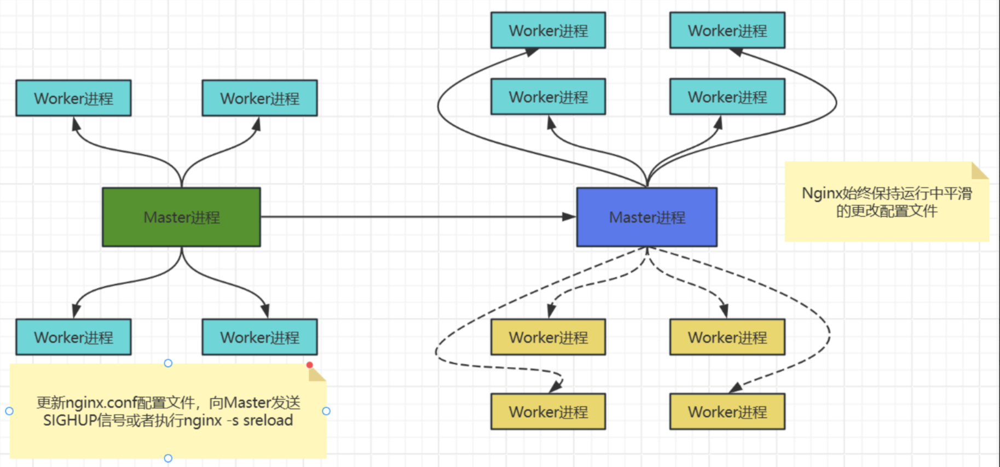
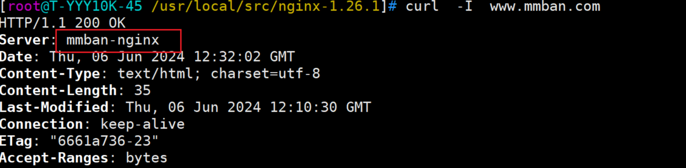
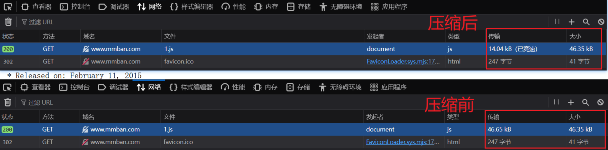
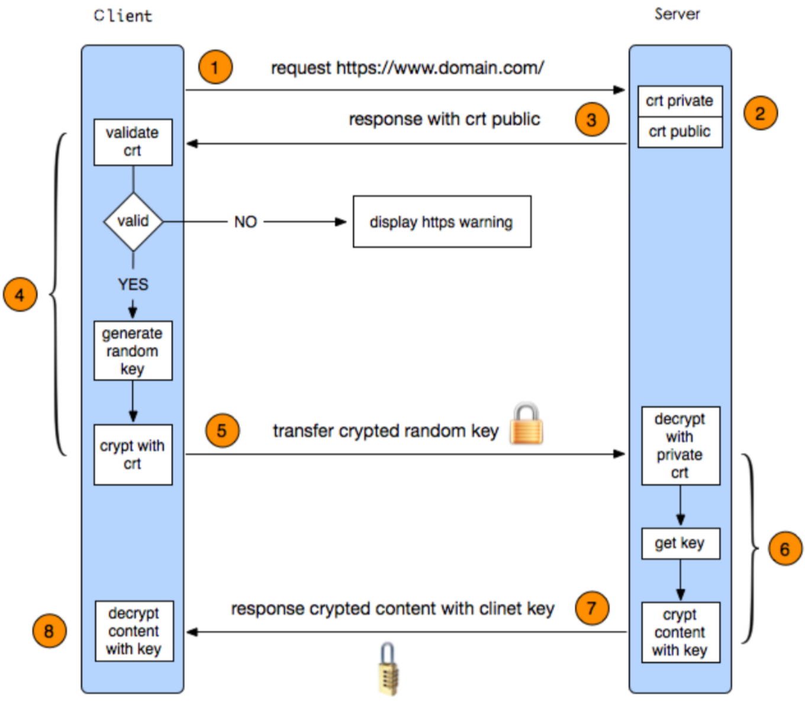
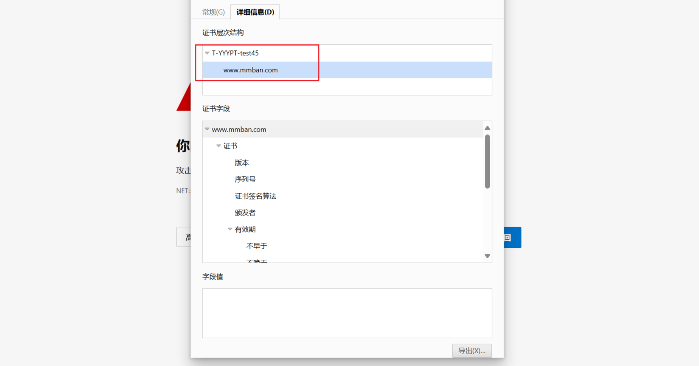
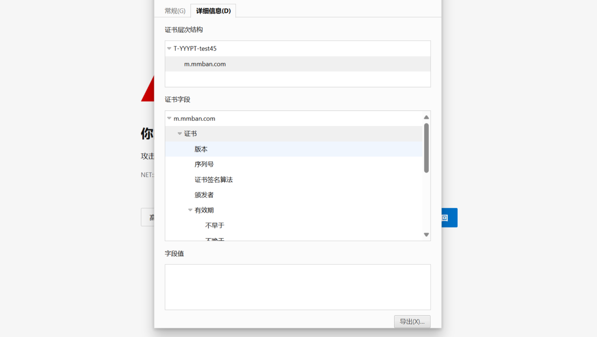
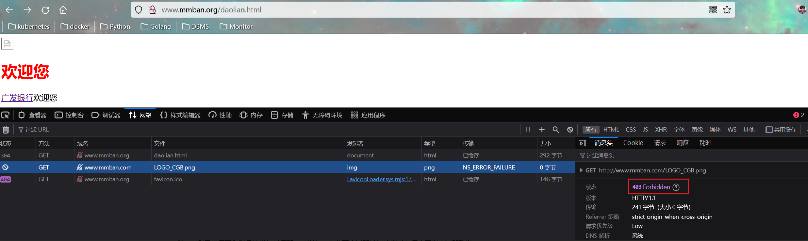

# Nginx配置文件

## 1.Nginx命令和信号

### 1.1.Nginx命令

~~~shell
nginx 命令支持向其发送信号,实现不同功能  
1. nginx 格式：
  a. nginx [-?hvVtTq] [-s signal] [-c filename] [-p prefix] [-g directives]
2. 选项说明：
  a. 帮助: -? -h
  b. 使用指定的配置文件: -c
  c. 指定配置指令:-g
  d. 指定运行目录:-p
  e. 测试配置文件是否有语法错误:-t -T
  f. 打印nginx的版本信息、编译信息等:-v -V
  g. 发送信号: -s 示例: nginx -s reload
3. 信号说明：
  a. 立刻停止服务：stop,相当于信号SIGTERM,SIGINT
  b. 优雅的停止服务:quit,相当于信号SIGQUIT
  c. 平滑重启，重新加载配置文件: reload,相当于信号SIGHUP
  d. 重新开始记录日志文件:reopen,相当于信号SIGUSR1,在切割日志时用途较大
  e. 平滑升级可执行程序:发送信号SIGUSR2,在升级版本时使用
  f. 优雅的停止工作进程:发送信号SIGWINCH,在升级版本时使用
~~~

### 1.2. QUIT 实现worker进程优雅关闭

1. 在 Nginx 中，实现 worker 进程的优雅关闭可以通过向主进程发送 QUIT 信号来完成。这个操作会使主进程通知所有 worker 进程完成当前处理的请求后再退出，从而避免中断正在进行的请求。

~~~shell
## 1. 查找 Nginx 主进程的 PID
[root@T-YYY10K-45 /apps/nginx]# cat /apps/nginx/logs/nginx.pid 
9834

## 2. 发送 QUIT 信号到主进程，一旦你获取到 Nginx 主进程的 PID，可以使用 kill 命令发送 QUIT 信号
[root@T-YYY10K-45 /apps/nginx]# kill -QUIT 9976
这个命令会触发 Nginx 主进程执行以下操作：
  1.停止接收新的连接。
  2.通知所有 worker 进程完成当前正在处理的请求后退出。
  3.当所有 worker 进程退出后，主进程自身也会退出。

## 3. 确认 Nginx 已经优雅地关闭
[root@T-YYY10K-45 /apps/nginx]# ps  -ef | grep   nginx
~~~

### 1.3. reload流程

1. 利用 reload 可以实现平滑修改配置并生效，不重启或者不停机，加载新的配置文件
2. 向master进程发送HUP信号(reload命令)
3. master进程校验配置语法是否正确，打开新的监听端口，用新配置启动新的worker子进程向老worker子进程发送QUIT信号，老的worker对已建立连接继续处理，处理完才会优雅退出.未关闭的worker旧进程不会处理新来的请求
4. 老worker进程关闭监听句柄，处理完当前连接后结束进程

## 2.配置目录

1. conf：保存nginx所有的配置文件，其中nginx.conf是nginx服务器的最核心最主要的配置文件，其他的.conf则是用来配置nginx相关的功能的，例如fastcgi功能使用的是fastcgi.conf和fastcgi_params两个文件，配置文件一般都有一个样板配置文件，是以.default为后缀，使用时可将其复制并将default后缀去掉即可。
2. html：目录中保存了nginx服务器的web文件，但是可以更改为其他目录保存web文件,另外还有一个50x的web文件是默认的错误页面提示页面。
3. logs：用来保存nginx服务器的访问日志错误日志等日志，logs目录可以放在其他路径，比如/var/logs/nginx里面。
4. sbin：保存nginx二进制启动脚本，可以接受不同的参数以实现不同的功能。

## 3.Nginx核心配置文件详解

1. nginx 官方帮助文档
   - http://nginx.org/en/docs/
2. tengine 帮助文档
   - http://tengine.taobao.org/nginx_docs/cn/docs/
3. Nginx的配置文件的组成部分
   - 主配置文件：nginx.conf
   - 子配置文件: include conf.d/*.conf
   - fastcgi， uwsgi，scgi 等协议相关的配置文件
   - mime.types：支持的mime类型，MIME(Multipurpose Internet Mail Extensions)多用途互联网邮件扩展类型，MIME消息能包含文本、图像、音频、视频以及其他应用程序专用的数据，是设定某种扩展名的文件用一种应用程序来打开的方式类型，当该扩展名文件被访问的时候，浏览器会自动使用指定应用程序来打开。多用于指定一些客户端自定义的文件名。
   - MIME参考文档：https://developer.mozilla.org/zh-CN/docs/Web/HTTP/Basics_of_HTTP/MIME_Types
4. nginx 配置文件格式说明
   - 配置文件由指令与指令块构成
   - 每条指令以;分号结尾，指令与值之间以空格符号分隔
   - 指令块以{ }大括号将多条指令组织在一起,且可以嵌套指令块
   - include语句允许组合多个配置文件以提升可维护性
   - 使用$符号使用变量，部分指令的参数支持正则表达式

~~~shell
Nginx 主配置文件的配置指令方式：
directive value [value2 ...];
注意
(1) 指令必须以分号结尾
(2) 支持使用配置变量
 内建变量：由Nginx模块引入，可直接引用
 自定义变量：由用户使用set命令定义,格式: set variable_name value;
 引用变量：$variable_name

 
主配置文件结构：四部分
 
main block：主配置段，即全局配置段，对http,mail都有效
 
#事件驱动相关的配置
event {
 ...
}   

#http/https 协议相关配置段
http {
 ...
}     

#默认配置文件不包括下面两个块
#mail 协议相关配置段
mail {
 ...
}    

#stream 服务器相关配置段
stream {
 ...
}
~~~

### 3.1.默认nginx.conf配置文件格式说明

~~~shell
## 全局配置端，对全局生效，主要设置nginx的启动用户/组，启动的工作进程数量，工作模式，Nginx的PID
路径，日志路径等。
user nginx nginx;
worker_processes  auto;   #启动工作进程数数量

 #events设置块，主要影响nginx服务器与用户的网络连接，比如是否允许同时接受多个网络连
接，使用哪种事件驱动模型处理请求，每个工作进程可以同时支持的最大连接数，是否开启对多工作进程下的
网络连接进行序列化等。
events {
     #设置单个nginx工作进程可以接受的最大并发，
     #作为web服务器的时候最大并发数为worker_connections * worker_processes
     #作为反向代理的时候为(worker_connections * worker_processes)/2
     worker_connections  1024;
}

 #http块是Nginx服务器配置中的重要部分，缓存、代理和日志格式定义等绝大多数功能和第三方模块都可以在这设置，http块可以包含多个server块，而一个server块中又可以包含多个location块，server块可以配置文件引入、MIME-Type定义、日志自定义、是否启用sendfile、连接超时时间和单个链接的请求上限等。
 http {
    include       mime.types;
    default_type application/octet-stream;

    #作为web服务器的时候打开sendfile加快静态文件传输，指定是否使用sendfile系统调用来传输文件,  
    #sendfile系统调用在两个文件描述符之间直接传递数据(完全在内核中操作)，从而避免了数据在内核缓 
    #冲区和用户缓冲区之间的拷贝，操作效率很高，被称之为零拷贝，硬盘 >>  kernel buffer (快速拷贝到kernelsocket buffer) >>协议栈
    sendfile       on;
    
    keepalive_timeout  65;  #长连接超时时间，单位是秒

     #设置一个虚拟机主机，可以包含自己的全局快，同时也可以包含多个location模块。比如本虚拟机监听的端口、本虚拟机的名称和IP配置，多个server 可以使用一个端口，比如都使用80端口提供web服务。
     server {
         listen       80;  #配置server监听的端口
         #本server的名称，当访问此名称的时候nginx会调用当前serevr内部的配置进程匹配。
         server_name localhost;
         
          #location其实是server的一个指令，为nginx服务器提供比较多而且灵活的指
令都是在location中体现的，主要是基于nginx接受到的请求字符串，对用户请求的UIL进行匹配，并对特
定的指令进行处理，包括地址重定向、数据缓存和应答控制等功能都是在这部分实现，另外很多第三方模块的配置也是在location模块中配置。
         location / {
                root   html; #相当于默认页面的目录名称，默认是安装目录的相对路径，可以使用绝对路径配置。
                index index.html index.htm; #默认的页面文件名称

        }

        error_page   500 502 503 504 /50x.html; #错误页面的文件名称
        location = /50x.html { #location处理对应的不同错误码的页面定义到/50x.html，这个跟对应其server中定义的目录下.
          root   html;  #定义默认页面所在的目录
          }
     }

     #导入其他路径的配置文件
     include /apps/nginx/conf.d/*.conf
 }
~~~

### 3.2全局配置

1. Main 全局配置段常见的配置指令分类
2. 正常运行必备的配置
3. 优化性能相关的配置
4. 用于调试及定位问题相关的配置
5. 事件驱动相关的配置

~~~shell
#启动Nginx工作进程的用户和组
user nginx nginx;

#启动Nginx工作进程的数量,一般设为和CPU核心数相同
worker_processes [number | auto];

#将Nginx工作进程绑定到指定的CPU核心默认Nginx是不进行进程绑定的，绑定并不是意味着当前nginx进程独占以一核心CPU，但是可以保证此进程不会运行在其他核心上，这就极大减少了nginx的工作进程在不同的cpu核心上的来回跳转，减少了CPU对进程的资源分配与回收以及内存管理等，可以有效的提升nginx服务器的性能。
worker_cpu_affinity 00000001 00000010 00000100 00001000 | auto ;

#示例:
#worker_cpu_affinity 0001 0010 0100 1000;第0号---第3号CPU
#worker_cpu_affinity 0101 1010;

#worker_processes  4;
worker_cpu_affinity 00000010 00001000 00100000 10000000;

#错误日志记录配置，语法：error_log file [debug | info | notice | warn | error | crit | alert | emerg]
error_log /apps/nginx/logs/error.log error;

#pid文件保存路径
pid       /apps/nginx/logs/nginx.pid;

#工作进程优先级，-20~20(19)，影响 Nginx 在系统中的资源分配。
1. 提高性能和响应速度
  设置较高的优先级（负值）可以让 Nginx 工作进程更频繁地获得 CPU 时间片，特别是在系统负载较高的情况下，可以提高处理请求的速度和整体性能。
worker_priority 0;

#所有worker进程能打开的文件数量上限,包括:Nginx的所有连接（例
如与代理服务器的连接等），而不仅仅是与客户端的连接,另一个考虑因素是实际的并发连接数不能超过系统级
别的最大打开文件数的限制.最好与ulimit -n 或者limits.conf的值保持一致
worker_rlimit_nofile 65536;
~~~

### 3.3.http配置

~~~shell

http {
 ...
 ...  #各server的公共配置
 server {    #每个server用于定义一个虚拟主机,第一个server为默认虚拟服务器
 ...
 }
 server {     
 ...
 server_name   #虚拟主机名
 root     #主目录
 alias     #路径别名
 location [OPERATOR] URL {     #指定URL的特性
 ...
 if CONDITION {
 ...
   }
  }
 }
}
~~~

#### 3.3.1.配置说明

~~~shell
http {
    #导入支持的文件类型,是相对于/apps/nginx/conf的目录
    include       mime.types;

    #除mime.types中文件类型外,设置其它文件默认类型，访问其它类型时会提示下载不匹配的类型文件
    default_type application/octet-stream;

    #日志配置部分
    #log_format main '$remote_addr - $remote_user [$time_local] "$request" '
    #                 '$status $body_bytes_sent "$http_referer" '
    #                 '"$http_user_agent" "$http_x_forwarded_for"';
    #access_log logs/access.log main;
    
    #自定义优化参数
    sendfile       on;

    #设置会话保持时间, 第二个值为响应首部:keep-Alived:timeout=65,可以和第一个值不同
    keepalive_timeout  65 65;

    #开启文件压缩
    gzip on;

    server {
        listen       80; #设置监听地址和端口
        
        #设置server name，可以以空格隔开写多个并支持正则表达式，如:*.magedu.com www.magedu.* ~^www\d+\.magedu\.com$ default_server
        server_name localhost;

        location / {
            root   html;
            index index.html index.htm;
        }
    }
}
~~~

### 3.4.MIME

~~~shell
#在响应报文中将指定的文件扩展名映射至MIME对应的类型
include           /etc/nginx/mime.types;

default_type     application/octet-stream;#除mime.types中的类型外，指定其它文件的默认MIME类型，浏览器一般会提示下载

types {
   text/html html;
   image/gif gif;
   image/jpeg jpg;
}

#MIME参考文档：
https://developer.mozilla.org/zh-CN/docs/Web/HTTP/Basics_of_HTTP/MIME_Types
~~~

### 3.5.配置文件参数

#### 3.5.1.指定响应报文Server首部

~~~shell
#是否在响应报文中的Content-Type显示指定的字符集，默认off不显示
charset charset | off;

#示例
charset utf-8;

#是否在响应报文的Server首部显示nginx版本
server_tokens on | off | build | string;
~~~

#### 3.5.2自定义响应报文的nginx版本信息

~~~shell
# 如果想自定义响应报文的nginx版本信息，需要修改源码文件，重新编译
# 如果server_tokens on，修改 src/core/nginx.h 修改第13-14行，如下示例
define NGINX_VERSION     "1.68.9"
define NGINX_VER         "wanginx/" NGINX_VERSION

# 如果server_tokens off，修改 src/http/ngx_http_header_filter_module.c 第49行，如下示例：
static char ngx_http_server_string[] = "Server: nginx" CRLF;

## 1.关闭nginx进程
[root@T-YYY10K-45 /root]# nginx  -s stop

## 2. 查看nginx模块
[root@T-YYY10K-45 /root]# nginx  -V
nginx version: nginx/1.26.1
built by gcc 8.5.0 20210514 (Red Hat 8.5.0-10) (GCC) 
built with OpenSSL 1.1.1k  FIPS 25 Mar 2021
TLS SNI support enabled
configure arguments: --prefix=/apps/nginx --user=nginx --group=nginx --with-http_ssl_module --with-http_v2_module --with-http_realip_module --with-http_stub_status_module --with-http_gzip_static_module --with-pcre --with-stream --with-stream_ssl_module --with-stream_realip_module

## 3.重新编译
[root@T-YYY10K-45 /usr/local/src/nginx-1.26.1]# ./configure  --prefix=/apps/nginx --user=nginx --group=nginx\
> --with-http_ssl_module --with-http_v2_module --with-http_realip_module \
> --with-http_stub_status_module --with-http_gzip_static_module --with-pcre --with-stream \
> --with-stream_ssl_module --with-stream_realip_module

## 4. 安装，启动
[root@T-YYY10K-45 /usr/local/src/nginx-1.26.1]# make  && make install
[root@T-YYY10K-45 /usr/local/src/nginx-1.26.1]# nginx

## 5.验证
[root@T-YYY10K-45 /usr/local/src/nginx-1.26.1]# curl  -I  www.mmban.com
HTTP/1.1 200 OK
Server: mmban-nginx
Date: Thu, 06 Jun 2024 12:32:02 GMT
Content-Type: text/html; charset=utf-8
Content-Length: 35
Last-Modified: Thu, 06 Jun 2024 12:10:30 GMT
Connection: keep-alive
ETag: "6661a736-23"
Accept-Ranges: bytes
~~~

### 4.nginx子配置文件

~~~shell
## 在配置文件的最后面添加此行,注意不要放在最前面,会导致前面的命令无法生效

http {

.........
## 最后http模块最后一行
include /apps/nginx/conf.d/*.conf;
}
~~~

### 5.location详细使用

1. 在一个server中location配置段可存在多个，用于实现从uri到文件系统的路径映射；ngnix会根据用户请求的URI来检查定义的所有location，按一定的优先级找出一个最佳匹配，而后应用其配置
2. 在没有使用正则表达式的时候，nginx会先在server中的多个location选取匹配度最高的一个uri，uri是用户请求的字符串，即域名后面的web文件路径，然后使用该location模块中的正则url和字符串，如果匹配成功就结束搜索，并使用此location处理此请求。
3. http://nginx.org/en/docs/http/ngx_http_core_module.html#location
4. location 正则表达式
   - =:  用于标准uri前，需要请求字串与uri精确匹配，大小敏感,如果匹配成功就停止向下匹配并立即处理请求
   - ^~:  用于标准uri前，表示包含正则表达式,并且匹配以指定的正则表达式开头,对uri的最左边部分做匹配检查，不区分字符大小写
   - ~:  用于标准uri前，表示包含正则表达式,并且区分大小写
   - ~*:  用于标准uri前，表示包含正则表达式,并且不区分大写不带符号 #匹配起始于此uri的所有的uri
   - \ :  用于标准uri前，表示包含正则表达式并且转义字符。可以将 . * ?等转义为普通符号
   - ?：匹配任意单个字符（除了换行符）或没有字符。表示前面的字符出现零次或一次。
   - 匹配优先级从高到低：
     - =,  ^~,  ~/~*,  不带符号

~~~shell
Syntax:	location [ = | ~ | ~* | ^~ ] uri { ... }

location @name { ... }

Default:	—

Context:	server, location

####################################
官方：location = / {
    [ configuration A ]
}

location / {
    [ configuration B ]
}

location /documents/ {
    [ configuration C ]
}

location ^~ /images/ {
    [ configuration D ]
}

location ~* \.(gif|jpg|jpeg)$ {
    [ configuration E ]
}
~~~

#### 5.1.精确匹配

1. 在server部分使用location配置一个web界面，例如：当访问nginx 服务器的/logo.jpg的时候要显示指定html文件的内容
2. 精确匹配一般用于匹配组织的logo等相对固定的URL,匹配优先级最高

~~~shell
## 配置文件
[root@T-YYYPT-test45 /apps/nginx/conf.d]# cat mmban.conf
server {
    listen 80;
    server_name www.mmban.com;
    location / {
        root /apps/nginx/html.d/mmban;
        index index.html;
    }
    location = /logo.jpg  {
        root /apps/nginx/html.d/images;
        index index.html;
   }
}

## html文件
[root@T-YYYPT-test45 /apps/nginx/html.d]# tree  .
.
├── images
│   ├── index.html
│   └── logo.jpg
└── mmban
    └── index.html

## 重启Nginx并测试访问  http://www.mmban.com/logo.jpg
~~~

#### 5.2.区分大小写

1. ~ 实现区分大小写的模糊匹配
2. 以下范例中, 如果访问uri中包含大写字母的JPG，则以下location匹配Ax.jpg条件不成功，因为 ~ 区分大小写，当用户的请求被执行匹配时发现location中定义的是小写的jpg，本次访问的uri匹配失败，后续要么继续往下匹配其他的location（如果有），要么报错给客户端。

~~~shel
## 配置文件
[root@T-YYYPT-test45 /apps/nginx/conf.d]# cat mmban.conf
server {
    listen 80;
    server_name www.mmban.com;
    location / {
        root /apps/nginx/html.d/mmban;
        index index.html;
    }
    location = /logo.jpg  {
        root /apps/nginx/html.d/images;
        index index.html;
   }

   location ~ /A.?\.jpg {   #匹配字母A开头的jpg图片，后面?表示A后面零次或一个字符
       root /apps/nginx/html.d/images;
       index index.html;
  }
}
~~~

#### 5.3.不区分大小写

1. ~* 用来对用户请求的uri做模糊匹配，uri中无论都是大写、都是小写或者大小写混合，此模式也都会匹配。
2. 通常使用此模式匹配用户request中的静态资源并继续做下一步操作
3. 此方式中,对于Linux文件系统上的文件仍然是区分大小写的,如果磁盘文件不存在,仍会提示404

~~~shell
## 配置文件
[root@T-YYYPT-test45 /apps/nginx/conf.d]# cat  mmban.conf
server {
    listen 80;
    server_name www.mmban.com;
    location / {
        root /apps/nginx/html.d/mmban;
        index index.html;
    }
    location = /logo.jpg  {
        root /apps/nginx/html.d/images;
        index index.html;
   }

   location ~ /A.?\.jpg {   #匹配字母A开头的jpg图片，后面?表示A后面零次或一个字符
       root /apps/nginx/html.d/images;
       index index.html;
  }

   location ~* /A.?\.jpg {
       root /apps/nginx/html.d/images;
       index index.html;
  }

}

## html文件
[root@T-YYYPT-test45 /apps/nginx/html.d/images]# tree  .
.
├── ab.jpg
├── aB.jpg
├── Ab.jpg
├── AB.jpg
├── index.html
└── logo.jpg

## 重启nginx，测试访问
对于不区分大小写的location，则可以访问任意大小写结尾的图片文件,如区分大小写则只能访问Aa.jpg此
类文件，不区分大小写则可以访问除了aa.jpg以外,还有其它的资源比如Aa.JPG、aA.jPG这样的混合名称文
件，但是还同时也要求nginx服务器的资源目录有相应的文件，比如:必须有Aa.JPG,aA.jPG这样文件存在。
~~~

#### 5.4.URI开始与文件名后缀匹配

1. 在 Nginx 中，可以使用 location 指令来匹配 URI 开头部分和文件名后缀的组合。如果希望同时匹配 URI 的开头和特定的文件后缀，可以结合前缀匹配和正则表达式来实现。

~~~shell
## 配置文件
[root@T-YYYPT-test45 /apps/nginx/conf.d]# cat mmban.conf
server {
    listen 80;
    server_name www.mmban.com;
    location / {
        root /apps/nginx/html.d/mmban;
        index index.html;
    }
    location = /logo.jpg  {
        root /apps/nginx/html.d/images;
        index index.html;
   }

   location ~ /A.?\.jpg {   #匹配字母A开头的jpg图片，后面?表示A后面零次或一个字符
       root /apps/nginx/html.d/images;
       index index.html;
  }

   location ~* /A.?\.jpg {
       root /apps/nginx/html.d/images;
       index index.html;
  }
   location ~ ^/jpg/.*\.jpg$ {
       root /apps/nginx/html.d/images;
       index index.html;

  }

}

## html配置文件
root@T-YYYPT-test45 /apps/nginx/html.d/images~ # tree
.
├── Abcd.jpg
├── ab.jpg
├── aB.jpg
├── Ab.jpg
├── AB.jpg
├── index.html
├── jpg
│   ├── Abcd.jpg
│   ├── ab.jpg
│   ├── aB.jpg
│   ├── Ab.jpg
│   ├── AB.jpg
│   └── logo.jpg
└── logo.jpg
~~~

#### 5.5.优先级

1. 匹配优先级：=, ^~, ～/～*，/
2. location优先级：(location =) > (location ^~ 路径) > (location ~,~* 正则顺序) > (location 完整路径) > (location 部分起始路径) > (/)

~~~shell
## 配置文件，优先级重上之下依次匹配
server {
    listen 80;
    server_name www.mmban.com;

    # 精确匹配
    location = /exact {
        # 配置内容
    }

    # 高优先级前缀匹配
    location ^~ /static/ {
        # 配置内容
    }

    # 正则匹配，大小写敏感
    location ~ \.php$ {
        # 配置内容
    }

    # 正则匹配，大小写不敏感
    location ~* \.(gif|jpg|jpeg)$ {
        # 配置内容
    }

    # 标准前缀匹配
    location /images/ {
        # 配置内容
    }

    location / {
        # 配置内容
    }
}
~~~

### 6.root与alias

1. root：指定web的家目录，在定义location的时候，文件的绝对路径等于 root+location
2. alias：定义路径别名，会把访问的路径重新定义到其指定的路径,文档映射的另一种机制;仅能用于location上下文,此指令使用较少

~~~shell
server {
    listen 80;
    server_name www.cy.com;

    location / {
        root /apps/nginx/html.d/cy;
        index index.html;
    }

     #注意about后不要加/ , 使用alias的时候uri后面如果加了斜杠,则下面的路径配置必须加斜杠，否则403
    location /about1 {
         
         #当访问about的时候，会显示alias定义的/opt/html/about里面的内容。
        alias /mnt/html/about1;
   }

}
~~~

### 7.Nginx四层访问控制

1. 访问控制基于模块ngx_http_access_module实现，可以通过匹配客户端源IP地址进行限制
2. 如果能在防火墙设备控制,最好就不要在nginx上配置,可以更好的节约资源
3. 官方帮助手册：http://nginx.org/en/docs/http/ngx_http_access_module.html

~~~shell
server {
    listen 80;
    server_name www.cy.com;
    location / {
        root /apps/nginx/html.d/cy;
        index index.html;
        deny  192.168.1.1;
        allow 192.168.1.0/24;
        allow 10.1.1.0/16;
        allow 2001:0db8::/32;
        deny all;  ## 按先小范围到大范围排序
    }
}
~~~

### 8.Nginx账户认证功能

1. Nginx 提供了基本的 HTTP 认证功能，可以通过配置 auth_basic 指令来保护指定的资源，使用户在访问这些资源时需要提供用户名和密码。
2. 官方帮助手册：http://nginx.org/en/docs/http/ngx_http_auth_basic_module.html

~~~shell
## 安装工具
#CentOS安装包
root@T-YYYPT-test45 /apps/nginx/html.d/images~ # yum -y install httpd-tools
#Ubuntu安装包
root@T-YYYPT-test45 /apps/nginx/html.d/images~ # apt -y install apache2-utils

#创建用户
#-b 非交互式方式提交密码
root@T-YYYPT-test45 /apps/nginx/html.d/images~ #  htpasswd -cb /apps/nginx/conf/.htpasswd mmban 123456
Adding password for user mmban
root@T-YYYPT-test45 /apps/nginx/html.d/images~ #  htpasswd -b /apps/nginx/conf/.htpasswd acp 123456
Adding password for user acp
root@T-YYYPT-test45 /apps/nginx/html.d/images~ #  tail /apps/nginx/conf/.htpasswd
mmban:$apr1$xeak.30e$KoH3NYot7437BYhKQa86/1
acp:$apr1$N8a9aRiQ$GtwY5DTw39to/2fCELthx1

## 配置文件
[root@T-YYYPT-test45 /apps/nginx/conf.d]# cat mmban.conf
server {

    listen 80;
    server_name www.mmban.com;

    ## http, server, location, limit_except
    ## 在所有 location 中明确设置认证配置，确保每个 location 都正确继承或覆盖全局设置。
    auth_basic           "closed site";
    auth_basic_user_file /apps/nginx/conf/.htpasswd;

    location / {
        root /apps/nginx/html.d/mmban;
        index index.html;
    }
    location = /logo.jpg  {
        root /apps/nginx/html.d/images;
        index index.html;
   }

   location ~ /A.?\.jpg {   #匹配字母A开头的jpg图片，后面?表示A后面零次或一个字符
       root /apps/nginx/html.d/images;
       index index.html;
  }

   location ~* /A.?\.jpg {
       root /apps/nginx/html.d/images;
       index index.html;
  }
   location ~ ^/jpg/.*\.jpg$ {
       root /apps/nginx/html.d/images;
       index index.html;

  }

}
~~~

### 9.自定义错误日志格式

Syntax:	error_log file [level];

Default:	error_log logs/error.log error;

Context:	main, http, mail, stream, server, location

1. 格式：debug, info, notice, warn, error, crit, alert, emerg

~~~shell
server {

    listen 80;
    server_name www.mmban.com;
    #auth_basic           "closed site";
    #auth_basic_user_file /apps/nginx/conf/.htpasswd;
    access_log /apps/nginx/logs/mmban/mmbam-error.log;
    #404转为302
    # 错误页面配置
    error_page 404 =302 /index.html;
    error_page 500 502 503 504 /error.html;

    location = /error.html {
        root /apps/nginx/html.d/images;
    }
}
~~~

### 10.检测文件是否存在

1. try_files会按顺序检查文件是否存在，返回第一个找到的文件或文件夹（结尾加斜线表示为文件夹），如果所有文件或文件夹都找不到，会进行一个内部重定向到最后一个参数。只有最后一个参数可以引起一个内部重定向，之前的参数只设置内部URI的指向。最后一个参数是回退URI且必须存在，否则会出现内部500错误。
2. 格式：
   - Syntax:	try_files file ... uri;
   - try_files file ... =code;
   - Default:	—
   - Context:	server, location

### 11.长连接配置

~~~shell
1. 格式
  a. Syntax:	keepalive_timeout timeout [header_timeout];
  b. Default:	
  c. keepalive_timeout 75s;
  d. Context:	http, server, location

2. timeout：指定服务器保持连接的时间，单位为秒。如果在此时间段内没有新的请求，该连接将被关闭。
  a. 设定保持连接超时时长，0表示禁止长连接，默认为75s，通常配置在http字段作为站点全局配置

3. header_timeout（可选）：指定等待客户端发送完整HTTP头的时间，单位为秒。
4. 格式
  a. Syntax:	keepalive_requests number;
  b. Default:	
  c. keepalive_requests 1000;
  d. Context:	http, server, location
5. 指令用于设置在一个保持连接期间可以发送的最大请求数。默认情况下，Nginx允许在一个连接上处理多达1000个请求。当达到这个限制时，Nginx将关闭连接。

################################################################

## http模块配置
1.减少连接建立和关闭的开销：通过允许在一个TCP连接上处理多个请求，减少了连接建立和关闭的开销，提高了服务器性能。
2.优化资源使用：设置合理的超时时间和请求数限制，可以避免长时间闲置的连接占用服务器资源。

http {
.............

    keepalive_timeout  75 60;
    keepalive_requests 1500;
    
.............
}

root@T-YYYPT-test45 /apps/nginx/conf.d~ # curl -I www.mmban.com
HTTP/1.1 200 OK
Server: mmban-nginx
Date: Mon, 17 Jun 2024 12:53:46 GMT
Content-Type: text/html; charset=utf-8
Content-Length: 41
Last-Modified: Thu, 13 Jun 2024 04:11:56 GMT
Connection: keep-alive
Keep-Alive: timeout=60 #######################
ETag: "666a718c-29"
Accept-Ranges: bytes
~~~

### 12.Nginx状态页

1. 基于nginx 模块 ngx_http_stub_status_module 实现，在编译安装nginx的时候需要添加编译参数--with-http_stub_status_module，否则配置完成之后监测会是提示语法错误。
2. 格式:
   - Syntax:	stub_status;
   - Default:	—
   - Context:	server, location

~~~shell 
root@T-YYYPT-test45 /usr/local/src/nginx-1.26.1~ # ./configure   --help  | grep -i  with-http_stub_status_module  
  --with-http_stub_status_module     enable ngx_http_stub_status_module

root@T-YYYPT-test45 /usr/local/src/nginx-1.26.1~ # nginx  -V
nginx version: nginx/1.26.1
built by gcc 8.5.0 20210514 (Red Hat 8.5.0-10) (GCC) 
built with OpenSSL 1.1.1k  FIPS 25 Mar 2021
TLS SNI support enabled
configure arguments: --prefix=/apps/nginx --user=nginx --group=nginx --with-http_ssl_module --with-http_v2_module --with-http_realip_module --with-http_stub_status_module --with-http_gzip_static_module --with-pcre --with-stream --with-stream_ssl_module --with-stream_realip_module

## 配置
location = /basic_status {
    stub_status;
}

####
Active connections： #当前处于活动状态的客户端连接数，包括连接等待空闲连接数=reading+writing+waiting
accepts：#统计总值，Nginx自启动后已经接受的客户端请求连接的总数。
handled：#统计总值，Nginx自启动后已经处理完成的客户端请求连接总数，通常等于accepts，除非有因
worker_connections： #限制等被拒绝的连接
requests：#统计总值，Nginx自启动后客户端发来的总的请求数。
Reading：#当前状态，正在读取客户端请求报文首部的连接的连接数,数值越大,说明排队现象严重,性能不足
Writing：#当前状态，正在向客户端发送响应报文过程中的连接数,数值越大,说明访问量很大
Waiting：#当前状态，正在等待客户端发出请求的空闲连接数，开启 keep-alive的情况下,这个值等于active – (reading+writing)

##分析网站当前访问量
root@T-YYYPT-test45 ~ # curl  www.mmban.com/status  2> /dev/null |awk '/Reading/{print $2,$4,$6}'
0 1 0
~~~

### 13.Nginx变量使用

#### 13.1.Nginx内置变量

1. nginx的变量可以在配置文件中引用，作为功能判断或者日志等场景使用。
2. 内置变量是由nginx模块自带，通过变量可以获取到众多的与客户端访问相关的值。
3. 官方手册：https://nginx.org/en/docs/varindex.html

~~~shell
## 常用内置变量

$remote_addr; 
#存放了客户端的地址，注意是客户端的公网IP

$proxy_add_x_forwarded_for
#此变量表示将客户端IP追加请求报文中X-Forwarded-For首部字段,多个IP之间用逗号分隔,如果请求中没
有X-Forwarded-For,就使用$remote_addr
the “X-Forwarded-For” client request header field with the $remote_addr variable 
appended to it, separated by a comma. If the “X-Forwarded-For” field is not 
present in the client request header, the $proxy_add_x_forwarded_for variable is 
equal to the $remote_addr variable.

$args; 
#变量中存放了URL中的所有参数，例如:http://www.magedu.org/main/index.do?

id=20190221&partner=search
#返回结果为: id=20190221&partner=search

$is_args
#如果有参数为? 否则为空
“?” if a request line has arguments, or an empty string otherwise

$document_root; 
#保存了针对当前资源的请求的系统根目录,例如:/apps/nginx/html。

$document_uri;
#保存了当前请求中不包含参数的URI，注意是不包含请求的指令，比
如:http://www.magedu.org/main/index.do?id=20190221&partner=search会被定义
为/main/index.do 
#返回结果为:/main/index.do

$host; 
#存放了请求的host名称
limit_rate 10240;
echo $limit_rate;

#如果nginx服务器使用limit_rate配置了显示网络速率，则会显示，如果没有设置， 则显示0
$remote_port;

#客户端请求Nginx服务器时随机打开的端口，这是每个客户端自己的端口
$remote_user;

#已经经过Auth Basic Module验证的用户名
$request_body_file;

#做反向代理时发给后端服务器的本地资源的名称
$request_method;

#请求资源的方式，GET/PUT/DELETE等
$request_filename;

#当前请求的资源文件的磁盘路径，由root或alias指令与URI请求生成的文件绝对路径，
如:/apps/nginx/html/main/index.html
$request_uri;

#包含请求参数的原始URI，不包含主机名，相当于:$document_uri?$args,例如：/main/index.do?
id=20190221&partner=search 
$scheme;

#请求的协议，例如:http，https,ftp等
$server_protocol;

#保存了客户端请求资源使用的协议的版本，例如:HTTP/1.0，HTTP/1.1，HTTP/2.0等
$server_addr;

#保存了服务器的IP地址
$server_name;

#请求的服务器的主机名
$server_port;

#请求的服务器的端口号
$http_user_agent;

#客户端浏览器的详细信息
$http_cookie;

#客户端的所有cookie信息
$cookie_<name>

#name为任意请求报文首部字部cookie的key名
$http_<name>
#name为任意请求报文首部字段,表示记录请求报文的首部字段，ame的对应的首部字段名需要为小写，如果有
横线需要替换为下划线
arbitrary request header field; the last part of a variable name is the field 
name converted to lower case with dashes replaced by underscores #用下划线代替横线
#示例: 
echo $http_user_agent; 
echo $http_host;
$sent_http_<name>
#name为响应报文的首部字段，name的对应的首部字段名需要为小写，如果有横线需要替换为下划线,此变量
有问题

echo $sent_http_server;
$arg_<name>
#此变量存放了URL中的指定参数，name为请求url中指定的参数
echo $arg_id;
~~~

#### 13.2.Nginx自定义变量

1. 格式
   - Syntax:	set $variable value;
   - Default:	—
   - Context:	server, location, if

~~~shell
   location /main {
     set $name mmban.com;  ##自定义变量
     default_type text/html;
     echo_reset_timer;
     echo hello world;
     echo "'hello world' takes about $echo_timer_elapsed sec.";
     echo hiya igor;
     echo "'hiya igor' takes about $echo_timer_elapsed sec.";
     echo "$name";  ## 使用自定义变量
   }  
~~~

#### 13.3.Nginx自定义访问日志

1. 访问日志是记录客户端即用户的具体请求内容信息，而在全局配置模块中的error_log是记录nginx服务器运行时的日志保存路径和记录日志的level，因此两者是不同的，而且Nginx的错误日志一般只有一个，但是访问日志可以在不同server中定义多个，定义一个日志需要使用access_log指定日志的保存路径，使用log_format指定日志的格式，格式中定义要保存的具体日志内容。
2. 访问日志由 ngx_http_log_module 模块实现
3. 官方手册：http://nginx.org/en/docs/http/ngx_http_log_module.html
4. 格式：
   - Syntax:	access_log path [format [buffer=size] [gzip[=level]] [flush=time] [if=condition]];
   - access_log off;
   - Default:	
   - access_log logs/access.log combined;
   - Context:	http, server, location, if in location, limit_except

~~~shell
##1.Nginx默认访问日志
    #log_format  main  '$remote_addr - $remote_user [$time_local] "$request" '
    #                  '$status $body_bytes_sent "$http_referer" '
    #                  '"$http_user_agent" "$http_x_forwarded_for"';

    #access_log  logs/access.log notice;

##2.主配置文件
http {
............

log_format access_json '{"@timestamp":"$time_iso8601",'
        '"host":"$server_addr",'
        '"clientip":"$remote_addr",'
        '"size":$body_bytes_sent,'
        '"responsetime":"$request_time",'
        '"upstreamtime":"$upstream_response_time",'
        '"upstreamhost":"$upstream_addr",'
        '"http_host":"$host",'
        '"uri":"$uri",'
        '"xff":"$http_x_forwarded_for",'
        '"referer":"$http_referer",'
        '"tcp_xff":"$proxy_protocol_addr",'
        '"http_user_agent":"$http_user_agent",'
        '"status":"$status"}';
        
.........
}

##3.子配置文件
server {
....

access_log /apps/nginx/logs/mmban/access_json.log access_json;

....
}
~~~

### 14.Nginx压缩功能

1. Nginx支持对指定类型的文件进行压缩然后再传输给客户端，而且压缩还可以设置压缩比例，压缩后的文件大小将比源文件显著变小，这样有助于降低出口带宽的利用率，不过会占用相应的CPU资源。
2. 减少传输数据量，从而加快页面加载速度。
3. Nginx对文件的压缩功能是依赖于模块 ngx_http_gzip_module,默认是内置模块
4. 官方手册：https://nginx.org/en/docs/http/ngx_http_gzip_module.html

~~~shell
##1.格式
gzip
语法: gzip on | off;
默认值: gzip off;
上下文: http, server, location, if in location
描述: 启用或禁用 gzip 压缩。

gzip_buffers
语法: gzip_buffers number size;
默认值: gzip_buffers 32 4k; / gzip_buffers 16 8k;
上下文: http, server, location
描述: 设置系统用于存储 gzip 压缩结果的数据缓冲区数量和大小；指定Nginx服务需要向服务器申请的缓存空间的个数和大小,平台不同,默认:32 4k或者16 8k;

gzip_comp_level
语法: gzip_comp_level level;
默认值: gzip_comp_level 1;
上下文: http, server, location
描述: 设置 gzip 压缩的压缩级别。范围是 1-9，1 表示最低压缩级别（最快），9 表示最高压缩级别（最慢）。

gzip_http_version
语法: gzip_http_version 1.0 | 1.1;
默认值: gzip_http_version 1.1;
上下文: http, server, location
描述: 指定用于压缩的 HTTP 协议版本。

gzip_min_lengt
语法: gzip_min_length length;
默认值: gzip_min_length 20;
上下文: http, server, location
描述: 设置允许压缩的最小响应体长度；#gzip压缩的最小文件，小于设置值的文件将不会压缩

gzip_proxied
语法: gzip_proxied off | expired | no-cache | no-store | private | no_last_modified | no_etag | auth | any;
默认值: gzip_proxied off;
上下文: http, server, location
描述: 设置在何种条件下对来自代理服务器的请求启用 gzip 压缩。

gzip_types
语法: gzip_types mime-type [mime-type ...];
默认值: gzip_types text/html;
上下文: http, server, location
描述: 设置需要压缩的 MIME 类型。默认情况下，仅 text/html 类型会被压缩。

gzip_vary
语法: gzip_vary on | off;
默认值: gzip_vary off;
上下文: http, server, location
描述: 是否在响应头中添加 Vary: Accept-Encoding，指示代理服务器根据 Accept-Encoding 头区分缓存内容。

gzip_static
语法: gzip_static on | off | always;
默认值: gzip_static off;
上下文: http, server, location
描述: 指定是否在提供文件时查找预压缩的 .gz 文件；预压缩，即直接从磁盘找到对应文件的gz后缀的式的压缩文件返回给用户，无需消耗服务器CPU。来自于ngx_http_gzip_static_module模块
on: 当客户端支持 gzip 压缩时，Nginx 查找并提供预压缩的 .gz 文件。
off: 禁用查找预压缩的 .gz 文件。
always: 总是查找预压缩的 .gz 文件，不考虑客户端是否支持 gzip 压缩。

gzip_disable
语法: gzip_disable regex ...;
默认值: ——
上下文: http, server, location
描述：gzip_disable 是 Nginx gzip 模块中的一个指令，用于禁用对特定 User-Agent 的 gzip 压缩。这对于处理某些不能正确处理 gzip 编码的旧版浏览器或其他用户代理是有用的。

########################################################################
##1.主配置文件
http {
..................

    gzip on;
    gzip_disable "MSIE [1-6]\.";
    #gzip_disable "MSIE [1-6]\.|Opera [1-9]\.|Safari [1-5]\.";
    gzip_buffers 16 8k;
    gzip_comp_level 2;
    gzip_http_version 1.1;
    gzip_min_length 1k;
    gzip_proxied any;
    gzip_vary on;
    gzip_types
        text/plain
        application/javascript
        application/x-javascript
        text/css
        application/xml
        text/javascript
        application/x-httpd-php
        image/jpeg
        image/gif
        image/png;
        
..........................
}
~~~

### 15.HTTPS功能

1. Web网站的登录页面通常都会使用https加密传输的，加密数据以保障数据的安全，HTTPS能够加密信息，以免敏感信息被第三方获取，所以很多银行网站或电子邮箱等等安全级别较高的服务都会采用HTTPS协议，HTTPS其实是有两部分组成：HTTP + SSL / TLS，也就是在HTTP上又加了一层处理加密信息的模块。服务端和客户端的信息传输都会通过TLS进行加密，所以传输的数据都是加密后的数据。
2. nginx 的https 功能基于模块ngx_http_ssl_module实现，因此如果是编译安装的nginx要使用参数ngx_http_ssl_module开启ssl功能，但是作为nginx的核心功能，yum安装的nginx默认就是开启的，编译安装的nginx需要指定编译参数--with-http_ssl_module开启.
3. 官方手册：https://nginx.org/en/docs/http/ngx_http_ssl_module.html

1. 客户端发起HTTPS请求：客户端访问某个web端的https地址，一般都是443端口
2. 服务端的配置：采用https协议的服务器必须要有一套证书，可以通过一些组织申请，也可以自己制作，目前国内很多网站都自己做的，当你访问一个网站的时候提示证书不可信任就表示证书是自己做的，证书就是一个公钥和私钥匙，就像一把锁和钥匙，正常情况下只有你的钥匙可以打开你的锁，你可以把这个送给别人让他锁住一个箱子，里面放满了钱或秘密，别人不知道里面放了什么而且别人也打不开，只有你的钥匙是可以打开的。
3. 传送证书：服务端给客户端传递证书，其实就是公钥，里面包含了很多信息，例如证书得到颁发机构、过期时间等等。
4. 客户端解析证书：这部分工作是有客户端完成的，首先回验证公钥的有效性，比如颁发机构、过期时间等等，如果发现异常则会弹出一个警告框提示证书可能存在问题，如果证书没有问题就生成一个随机值，然后用证书对该随机值进行加密，就像2步骤所说把随机值锁起来，不让别人看到。
5. 传送4步骤的加密数据：就是将用证书加密后的随机值传递给服务器，目的就是为了让服务器得到这个随机值，以后客户端和服务端的通信就可以通过这个随机值进行加密解密了。
6. 服务端解密信息：服务端用私钥解密5步骤加密后的随机值之后，得到了客户端传过来的随机值(私钥)，然后把内容通过该值进行对称加密，对称加密就是将信息和私钥通过算法混合在一起，这样除非你知道私钥，不然是无法获取其内部的内容，而正好客户端和服务端都知道这个私钥，所以只要机密算法够复杂就可以保证数据的安全性。
7. 传输加密后的信息:  服务端将用私钥加密后的数据传递给客户端，在客户端可以被还原出原数据内容。
8. 客户端解密信息：客户端用之前生成的私钥获解密服务端传递过来的数据，由于数据一直是加密的，因此即使第三方获取到数据也无法知道其详细内容

#### 15.1.自签名证书 

~~~shell
## 创建目录
root@T-YYYPT-test45 /apps/nginx~ # mkdir certs

 ## 自签名CA证书
root@T-YYYPT-test45 /apps/nginx/certs~ # openssl req -newkey rsa:4096 -nodes -sha256 -keyout ca.key -x509 -days 3650 -out ca.crt
Generating a RSA private key
................................................++++
...............++++
writing new private key to 'ca.key'
-----
You are about to be asked to enter information that will be incorporated
into your certificate request.
What you are about to enter is what is called a Distinguished Name or a DN.
There are quite a few fields but you can leave some blank
For some fields there will be a default value,
If you enter '.', the field will be left blank.
-----
Country Name (2 letter code) [XX]:CN
State or Province Name (full name) []:GZ
Locality Name (eg, city) [Default City]:GZ
Organization Name (eg, company) [Default Company Ltd]:GF
Organizational Unit Name (eg, section) []:devops
Common Name (eg, your name or your servers hostname) []:ca.mmban.com
Email Address []:

 
##自制key和csr文件
root@T-YYYPT-test45 /apps/nginx/certs~ # openssl req -newkey rsa:4096 -nodes -sha256 -keyout www.mmban.com.key -out www.mmban.com.csr
Generating a RSA private key
..................................................................................++++
............++++
writing new private key to 'www.mmban.com.key'
-----
You are about to be asked to enter information that will be incorporated
into your certificate request.
What you are about to enter is what is called a Distinguished Name or a DN.
There are quite a few fields but you can leave some blank
For some fields there will be a default value,
If you enter '.', the field will be left blank.
-----
Country Name (2 letter code) [XX]:CN
State or Province Name (full name) []:GZ
Locality Name (eg, city) [Default City]:GZ
Organization Name (eg, company) [Default Company Ltd]:mmban.com
Organizational Unit Name (eg, section) []:mmban.com
Common Name (eg, your name or your servers hostname) []:www.mmban.com
Email Address []:

Please enter the following 'extra' attributes
to be sent with your certificate request
A challenge password []:
An optional company name []:

## 签发证书
root@T-YYYPT-test45 /apps/nginx/certs~ # openssl x509 -req -days 3650 -in www.mmban.com.csr -CA ca.crt -CAkey ca.key -CAcreateserial -out www.mmban.com.crt
Signature ok
subject=C = CN, ST = GZ, L = GZ, O = mmban.com, OU = mmban.com, CN = www.mmban.com
Getting CA Private Key

###验证证书内容
root@T-YYYPT-test45 /apps/nginx/certs~ # openssl x509 -in www.mmban.com.crt -noout -text         
Certificate:
    Data:
        Version: 1 (0x0)
        Serial Number:
            7f:82:7c:e1:d7:54:85:93:c2:ef:93:d0:bd:ad:30:be:ea:32:4b:62
        Signature Algorithm: sha256WithRSAEncryption
        Issuer: C = CN, ST = GZ, L = GZ, O = GF, OU = devops, CN = T-YYYPT-test45
        Validity
            Not Before: Jun 19 04:26:20 2024 GMT
            Not After : Jun 17 04:26:20 2034 GMT
        Subject: C = CN, ST = GZ, L = GZ, O = mmban.com, OU = mmban.com, CN = www.mmban.com
        Subject Public Key Info:
            Public Key Algorithm: rsaEncryption
                RSA Public-Key: (4096 bit)

#合并CA和服务器证书成一个文件,注意服务器证书在前
root@T-YYYPT-test45 /apps/nginx/certs~ # cat www.mmban.com.crt ca.crt > www.mmban.com.pem 
~~~

#### 15.2.https配置

~~~shell
server {
    access_log /apps/nginx/logs/mmban/access_json.log access_json;

    listen 80;
    listen       443 ssl;
    ssl_certificate /apps/nginx/certs/www.mmban.com.pem;
    ssl_certificate_key /apps/nginx/certs/www.mmban.com.key;
    ssl_session_cache shared:sslcache:20m;
    ssl_session_timeout 10m;
    server_name www.mmban.com;

    ##.........
}

#####################################################
ssl on | off;   
#为指定的虚拟主机配置是否启用ssl功能，此功能在1.15.0废弃，使用listen [ssl]替代
listen 443 ssl;

ssl_certificate /path/to/file;
#指向包含当前虚拟主机和CA的两个证书信息的文件，一般是crt文件

ssl_certificate_key /path/to/file;
#当前虚拟主机使用的私钥文件，一般是key文件

ssl_protocols [SSLv2] [SSLv3] [TLSv1] [TLSv1.1] [TLSv1.2]; 
#支持ssl协议版本，早期为ssl现在是TLS，默认为后三个

ssl_session_cache off | none | [builtin[:size]] [shared:name:size];
#配置ssl缓存
 off： #关闭缓存
 none:  #通知客户端支持ssl session cache，但实际不支持
 builtin[:size]：#使用OpenSSL内建缓存，为每worker进程私有
 [shared:name:size]：#在各worker之间使用一个共享的缓存，需要定义一个缓存名称和缓存空间大
小，一兆可以存储4000个会话信息，多个虚拟主机可以使用相同的缓存名称

ssl_session_timeout time;
#客户端连接可以复用ssl session cache中缓存的有效时长，默认5m

##重启NGINX服务
root@T-YYYPT-test45 /apps/nginx/conf~ # nginx  -t
nginx: the configuration file /apps/nginx/conf/nginx.conf syntax is ok
nginx: configuration file /apps/nginx/conf/nginx.conf test is successful

root@T-YYYPT-test45 /apps/nginx/conf~ # nginx  -s reload
~~~

#### 15.3.实现多域名https

1. Nginx 支持基于单个IP实现多域名的功能，并且还支持单IP多域名的基础之上实现HTTPS，其实是基于Nginx的 SNI（Server Name Indication）功能实现，SNI是为了解决一个Nginx服务器内使用一个IP绑定多个域名和证书的功能，其具体功能是客户端在连接到服务器建立SSL链接之前先发送要访问站点的域名（Hostname），这样服务器再根据这个域名返回给客户端一个合适的证书

~~~shell 
###制作key和csr文件
root@T-YYYPT-test45 /apps/nginx/certs~ # openssl req -newkey rsa:4096 -nodes -sha256 -keyout m.mmban.com.key -out m.mmban.com.csr
Generating a RSA private key
.....................................................................++++
.......................................................................................++++
writing new private key to 'm.mmban.com.key'
-----
You are about to be asked to enter information that will be incorporated
into your certificate request.
What you are about to enter is what is called a Distinguished Name or a DN.
There are quite a few fields but you can leave some blank
For some fields there will be a default value,
If you enter '.', the field will be left blank.
-----
Country Name (2 letter code) [XX]:CN
State or Province Name (full name) []:CQ
Locality Name (eg, city) [Default City]:CQ
Organization Name (eg, company) [Default Company Ltd]:mmban
Organizational Unit Name (eg, section) []:mmban
Common Name (eg, your name or your server s hostname) []:m.mmban.com     
Email Address []:

Please enter the following 'extra' attributes
to be sent with your certificate request
A challenge password []:
An optional company name []:

##签名证书
root@T-YYYPT-test45 /apps/nginx/certs~ # openssl x509 -req -days 3650 -in m.mmban.com.csr -CA ca.crt -CAkey ca.key -CAcreateserial -out m.mmban.com.crt
Signature ok
subject=C = CN, ST = CQ, L = CQ, O = mmban, OU = mmban, CN = m.mmban.com
Getting CA Private Key

##合并证书文件
root@T-YYYPT-test45 /apps/nginx/certs~ # cat m.mmban.com.crt ca.crt > m.mmban.com.pem
~~~

#### 15.4.https配置

~~~shell
server {
    access_log /apps/nginx/logs/mmban/access_json.log access_json;

    listen 80;
    listen       443 ssl;
    ssl_certificate /apps/nginx/certs/m.mmban.com.pem;
    ssl_certificate_key /apps/nginx/certs/m.mmban.com.key;
    ssl_session_cache shared:sslcache:20m;
    ssl_session_timeout 10m;
    server_name m.mmban.com;
    #auth_basic           "closed site";
    #auth_basic_user_file /apps/nginx/conf/.htpasswd;
    #access_log /apps/nginx/logs/mmban/mmbam-error.log;
    #404转为302
    # 错误页面配置
    error_page 404 =302 /index.html;
    error_page 500 502 503 504 /error.html;
}

## 重启NGINX
~~~

### 16.配置rewrite实现http跳转到https

1. 官方手册：https://blog.nginx.org/blog/http-strict-transport-security-hsts-and-nginx

~~~shell
server {
    access_log /apps/nginx/logs/mmban/access_json.log access_json;

    listen 80;
    listen       443 ssl;
    ssl_certificate /apps/nginx/certs/www.mmban.com.pem;
    ssl_certificate_key /apps/nginx/certs/www.mmban.com.key;
    ssl_session_cache shared:sslcache:20m;
    ssl_session_timeout 10m;
    server_name www.mmban.com;
    add_header Strict-Transport-Security "max-age=31536000; includeSubDomains" always;
    #auth_basic           "closed site";
    #auth_basic_user_file /apps/nginx/conf/.htpasswd;
    #access_log /apps/nginx/logs/mmban/mmbam-error.log;
    #404转为302
    # 错误页面配置
    error_page 404 =302 /index.html;
    error_page 500 502 503 504 /error.html;

    location = /error.html {
        root /apps/nginx/html.d/images;
    }

    location / {
        if ( $scheme = http ) {
            rewrite ^/(.*)$ https://www.mmban.com/$1 redirect;
        }
        root /apps/nginx/html.d/mmban;
        index index.html;
    }
}
~~~

### 17.关于 favicon.ico

1. favicon.ico 文件是浏览器收藏网址时显示的图标，当客户端使用浏览器问页面时，浏览器会自己主动发起请求获取页面的favicon.ico文件，但是当浏览器请求的favicon.ico文件不存在时，服务器会记录404日志，而且浏览器也会显示404报错

~~~shell
#方法一：服务器不记录访问日志：
location = /favicon.ico {
   log_not_found off;
   access_log off;
}

#方法二：将图标保存到指定目录访问：
#location ~ ^/favicon\.ico$ {
location = /favicon.ico {
     root   /data/nginx/html/pc/images;
     expires 365d;  #设置文件过期时间
}
~~~

### 18.Nginx Rewrite模块相关功能

1. Nginx服务器利用 ngx_http_rewrite_module 模块解析和处理rewrite请求，此功能依靠 PCRE(perl compatible regular expression)，因此编译之前要安装PCRE库。
2. rewrite用于实现URL的重写，比如可以在我们改变网站结构之后，不需要客户端修改原来的书签，也无需其他网站修改我们的链接，就可以设置为访问，另外还可以在一定程度上提高网站的安全性。
3. 官方手册：https://nginx.org/en/docs/http/ngx_http_rewrite_module.html

#### 18.1.break

1. 用于中断当前相同作用域(location)中的其他Nginx配置，与该指令处于同一作用域的Nginx配置中，位于它前面的配置生效，位于后面的 ngx_http_rewrite_module 模块中指令就不再执行，
2. Nginx服务器在根据配置处理请求的过程中遇到该指令的时候，回到上一层作用域继续向下读取配置，该指令可以在server块和locationif块中使用
3. 如果break指令在location块中后续指令还会继续执行,只是不执行 ngx_http_rewrite_module 模块的指令,其它指令还会执行

~~~shell
Syntax:	break;
Default:	—
Context:	server, location, if
~~~

#### 18.2.if

1. 用于条件匹配判断，并根据条件判断结果选择不同的Nginx配置，可以配置在server或location块中进行配置。
2. Nginx的if语法仅能使用if做单次判断，不支持使用if else或者if elif这样的多重判断。
3. 使用正则表达式对变量进行匹配，匹配成功时if指令认为条件为true，否则认为false，变量与表达式之 间使用以下符号链接：
   - =：比较变量和字符串是否相等，相等时if指令认为该条件为true，反之为false
   - != ：比较变量和字符串是否不相等，不相等时if指令认为条件为true，反之为false
   - ~ ：区分大小写字符，可以通过正则表达式匹配，满足匹配条件为真，不满足匹配条件为假
   - !~ ：区分大小写字符,判断是否匹配，不满足匹配条件为真，满足匹配条件为假
   - ~* ：不区分大小写字符，可以通过正则表达式匹配，满足匹配条件为真，不满足匹配条件为假
   - !~* ：不区分大小字符,判断是否匹配，满足匹配条件为假，不满足匹配条件为真
   - -f 和 !-f ：判断请求的文件是否存在和是否不存在
   - -d 和 !-d ：判断请求的目录是否存在和是否不存在
   - -x 和 !-x ：判断文件是否可执行和是否不可执行
   - e 和 !-e ：判断请求的文件或目录是否存在和是否不存在(包括文件，目录，软链接)
   - 如果$变量的值为空字符串或0，则if指令认为该条件为false，其他条件为true。

~~~shell
##1.格式
Syntax:	if (condition) { ... }
Default:	—
Context:	server, location

##2.用法
if （条件匹配） { 
 action
}

####################################################################################
##3.基于 User-Agent 的重定向
server {
    if ($http_user_agent ~* "(Android|webOS|iPhone|iPad|iPod|BlackBerry|IEMobile|Opera Mini|Firefox)") {
        return 302 https://www.cgbchina.com.cn$request_uri;
    }
    access_log /apps/nginx/logs/mmban/access_json.log access_json;

    listen 80;
    listen       443 ssl;
    ssl_certificate /apps/nginx/certs/www.mmban.com.pem;
    ssl_certificate_key /apps/nginx/certs/www.mmban.com.key;
    ssl_session_cache shared:sslcache:20m;
    ssl_session_timeout 10m;
    server_name www.mmban.com;
    add_header Strict-Transport-Security "max-age=31536000; includeSubDomains" always;

    error_page 404 =302 /index.html;
    error_page 500 502 503 504 /error.html;

    location = /error.html {
        root /apps/nginx/html.d/images;
    }

    location / {
        if ( $scheme = http ) {
            rewrite ^/(.*)$ https://www.mmban.com/$1 redirect;
        }
        root /apps/nginx/html.d/mmban;
        index index.html;
    }
}
~~~

#### 18.3.return

~~~shell
##1.格式
Syntax:	return code [text];
return code URL;
return URL;
Default:	—
Context:	server, location, if
~~~

#### 18.4.rewrite

~~~shell 
##1.格式
Syntax:	rewrite regex replacement [flag];
Default:	—
Context:	server, location, if
~~~

#### 18.5.rewrite_log

~~~shell
##1.格式
Syntax:	rewrite_log on | off;
Default:	
rewrite_log off;
Context:	http, server, location, if
~~~

#### 18.6.set

1. 指定key并给其定义一个变量，变量可以调用Nginx内置变量赋值给key，另外set定义格式为set $key value，value可以是text, variables和两者的组合。

~~~shell
##1.格式
Syntax:	set $variable value;
Default:	—
Context:	server, location, if

   location /main {
     default_type text/html;
     root /apps/nginx/html.d/mmban;
     index index.html;
     set $name mmban.com;
     echo $name;
     set $my_port $server_port;
     echo $my_port;
   }
~~~

### 19.Nginx防盗链

1. 防盗链基于客户端携带的referer实现，referer是记录打开一个页面之前记录是从哪个页面跳转过来的标记信息，如果别人只链接了自己网站图片或某个单独的资源，而不是打开了网站的整个页面，这就是盗链。
2. referer信息有以下几种：
   - none：请求报文首部没有referer首部，比如用户直接在浏览器输入域名访问web网站，就没有referer信息。
   - blocked：请求报文有referer首部，但无有效值，比如为空。
   - server_names：referer首部中包含本主机名及即nginx 监听的server_name。
   - arbitrary_string：自定义指定字符串，但可使用*作通配符。示例: *.magedu.org www.mmban.*
   - regular expression：被指定的正则表达式模式匹配到的字符串,要使用~开头，例如：~.*\.mmban\.com

~~~json
## 正常通过搜索引擎搜索web 网站并访问该网站的referer信息如下：

{"@timestamp":"2024-06-21T12:21:49+08:00","host":"192.168.1.45","clientip":"192.168.1.1","size":0,"responsetime":"0.000","upstreamtime":"-","upstreamhost":"-","http_host":"www.mmban.com","uri":"/index.html","xff":"-","referer":"-","tcp_xff":"-","http_user_agent":"Mozilla/5.0 (Windows NT 10.0; Win64; x64; rv:126.0) Gecko/20100101 Firefox/126.0","status":"304"}
~~~

#### 19.1.实现防盗链配置环境

~~~shell
##在一个web 站点盗链另一个站点的资源信息，比如:图片、视频等
##新建一个主机www.mmban.org,盗取另一台主机www.mmban.com的图片
root@T-YYYPT-test45 /apps/nginx/conf.d~ # cat mmbanorg.conf 
server {
  listen 80;
  server_name www.mmban.org;
  location / {
    root /apps/nginx/html.d/mmbanorg;
    index  index.html;
    access_log /apps/nginx/logs/mmban/access-mmbanorg-json.log access_json;
 } 
}

##################################################

root@T-YYYPT-test45 /apps/nginx/html.d~ # cat mmbanorg/daolian.html
<html>
        <head>
                <meta http-equiv=Content-Type content="text/html;charset=utf-8">
                <title>盗链</title>
        </head>
        <body>
                
                <h1 style="color:red">欢迎您</h1>
                
<a href=http://www.mmban.org>广发银行</a>欢迎您

        </body>
</html>
~~~

~~~json 
{"@timestamp":"2024-06-21T12:44:05+08:00","host":"192.168.1.45","clientip":"192.168.1.1","size":0,"responsetime":"0.000","upstreamtime":"-","upstreamhost":"-","http_host":"www.mmban.org","uri":"/daolian.html","xff":"-","referer":"-","tcp_xff":"-","http_user_agent":"Mozilla/5.0 (Windows NT 10.0; Win64; x64; rv:126.0) Gecko/20100101 Firefox/126.0","status":"304"}
~~~

#### 19.2.配置防盗链

1. 基于访问安全考虑，nginx支持通过ngx_http_referer_module模块,检查访问请求的referer信息是否有效实现防盗链功能
2. 官方手册：https://nginx.org/en/docs/http/ngx_http_referer_module.html

~~~shell
root@T-YYYPT-test45 /apps/nginx/conf.d~ # cat mmban.conf
server {
    valid_referers none blocked server_names
    *.mmban.com *.mmbanb1.org ~\.google\. ~\.baidu\. ~\.bing\. ~\.so\. ~\.dogedoge\. ; #定义有效的referer

    if ($invalid_referer) { #假如是使用其他的无效的referer访问
      return 403 "Forbidden Access"; #返回状态码403
    }

    ............
}
~~~

